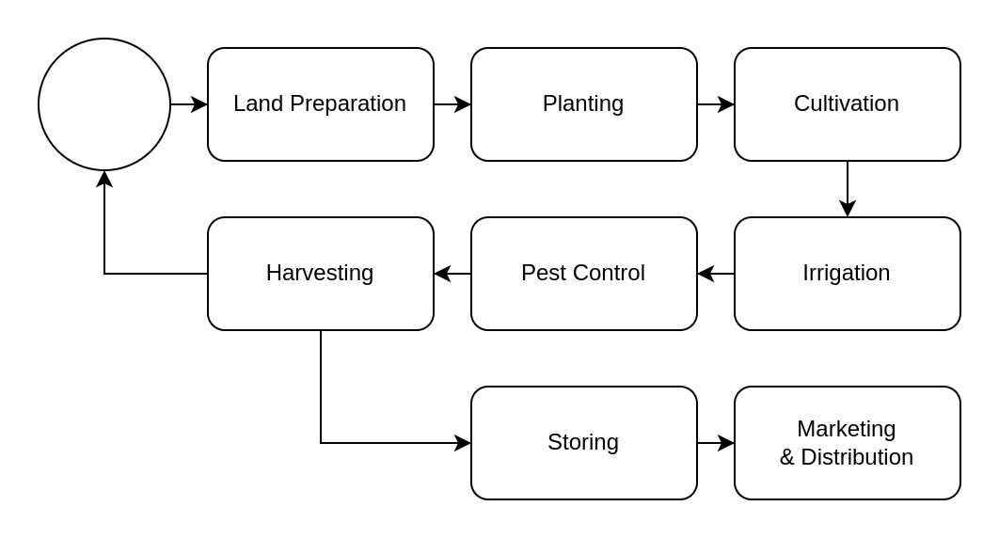

# Crop Farming

## Process

The process in crop farming can be discribed as the following :

### Land Preparation

1. **Site Selection:**
   - Choose a suitable location for farming, considering factors such as soil type, sunlight exposure, water availability, and accessibility.

2. **Clearing:**
   - Remove any existing vegetation, debris, or obstacles from the selected area. This may involve clearing trees, bushes, rocks, and other materials.

3. **Plowing:**
   - Use plows or other mechanized equipment to break and turn over the soil. Plowing helps loosen compacted soil, improves aeration, and facilitates better water penetration.

4. **Harrowing:**
   - Follow plowing with harrowing, a process that breaks down clumps of soil and creates a finer, more even seedbed. Harrowing also helps to incorporate organic matter into the soil.

5. **Leveling:**
   - Level the field to create a smooth and uniform surface. This promotes even water distribution during irrigation and prevents waterlogging in specific areas.

6. **Adding Amendments:**
   - Based on soil tests, add soil amendments such as organic matter, lime, or fertilizers to improve nutrient levels and pH. This ensures that the soil provides an optimal environment for plant growth.

7. **Ridging or Bedding (Optional):**
   - In some cases, farmers create ridges or beds to improve drainage and provide better access for planting and cultivation. This is particularly common in areas with heavy rainfall.

8. **Compaction:**
   - Use rollers or compactors to achieve the desired level of soil compaction. Proper compaction is essential for seed-to-soil contact and helps maintain moisture in the root zone.

9. **Irrigation System Installation (Optional):**
   - If an irrigation system is planned, install the necessary infrastructure during land preparation to ensure efficient water management.

10. **Final Smoothing:**
    - Smooth the surface of the prepared land to eliminate large clods and create an even seedbed. This facilitates uniform seed placement and germination.

11. **Marking Rows or Furrows (Optional):**
    - Mark rows or furrows for planting, especially in larger fields. This helps in maintaining proper spacing and organization during planting.

12. **Waiting Period:**
    - Allow the prepared land to rest for a short period to allow the soil to settle and for any remaining vegetation to decompose.

The effectiveness of land preparation significantly influences crop health and yield. It provides a favorable environment for seeds to germinate, roots to establish, and plants to grow successfully. The specific techniques used in land preparation can vary depending on the crop, local climate, and farming practices.

### Planting

1. **Seed Selection:**
   - Choose high-quality seeds based on factors such as seed variety, germination rate, disease resistance, and suitability for the specific growing conditions.

2. **Seed Treatment (Optional):**
   - Some seeds undergo treatment processes such as coating with fungicides or insecticides to protect against diseases or pests. This step is particularly common in commercial farming.

3. **Planting Method:**
   - Determine the planting method based on the crop type. Common methods include direct seeding, where seeds are planted directly in the soil, or transplanting, where young seedlings are transplanted from nurseries.

4. **Planting Depth:**
   - Plant seeds at the recommended depth, which varies depending on the crop. The depth is crucial for proper germination and initial root development.

5. **Plant Spacing:**
   - Space seeds or seedlings at appropriate distances to ensure optimal sunlight exposure, nutrient availability, and air circulation. Proper spacing minimizes competition among plants.

6. **Row Configuration:**
   - Arrange rows in a configuration that maximizes the use of space and facilitates efficient cultivation and harvesting. The configuration depends on the crop and farming equipment.

7. **Planting Equipment:**
   - Use appropriate planting equipment based on the scale of farming. This can include hand tools for small-scale farming or mechanized planters for larger fields.

8. **Sowing Techniques:**
   - Employ suitable sowing techniques, such as broadcasting (scattering seeds over the soil), drilling (placing seeds in rows), or dibbling (making holes for seeds).

9. **Planting Time:**
   - Plant crops during the recommended planting season for the specific region and crop type. This timing is critical for optimal growth and yield.

10. **Watering (Optional):**
    - Depending on the moisture content of the soil and local climate conditions, provide initial watering to facilitate seed germination.

11. **Mulching (Optional):**
    - Apply mulch around planted seeds or seedlings to conserve soil moisture, suppress weeds, and regulate soil temperature.

12. **Nursery Transplanting (If applicable):**
    - For crops that are initially grown in nurseries, carefully transplant seedlings into the prepared field. Handle seedlings with care to avoid damage to roots and shoots.

13. **Labeling (Optional):**
    - If planting different crop varieties or experimenting with various techniques, use labels to identify and track each planting area.

14. **Monitoring and Adjusting:**
    - Regularly monitor the planted area for signs of germination, emergence, and early growth. Adjust planting practices as needed based on observations.

### Cultivation

Cultivation is a crucial phase in crop farming that involves a series of activities aimed at managing the growth and development of crops. This phase spans the period from germination to maturity and includes practices to ensure the health, productivity, and quality of the crop.

1. **Early Growth Monitoring:**
   - Begin by monitoring the early growth of crops to ensure successful germination and emergence. Assess the stand establishment and identify any issues, such as gaps in plant density.

2. **Weeding:**
   - Remove weeds that compete with crops for nutrients, sunlight, and water. Weeding helps prevent weed interference and ensures optimal crop growth.

3. **Thinning (if necessary):**
   - If seeds were sown densely, thin out the weaker or excess seedlings to achieve the recommended spacing between plants. This promotes healthier and more vigorous growth.

4. **Watering:**
   - Provide irrigation as needed to maintain adequate soil moisture levels. Proper watering is crucial for promoting root development and preventing water stress.

5. **Fertilization:**
   - Apply fertilizers at appropriate stages of plant growth to supplement soil nutrients. Fertilization ensures that crops receive essential elements for robust development.

6. **Cropping Systems (if applicable):**
   - Implement specific cropping systems, such as intercropping or crop rotation, based on the planned agricultural practices. These systems help optimize resource use and minimize pests and diseases.

7. **Staking or Trellising (if applicable):**
   - Some crops, like tomatoes or beans, may require staking or trellising to support vertical growth, prevent lodging, and facilitate harvesting.

8. **Pruning (if applicable):**
   - Prune excessive foliage or non-productive parts of certain crops to redirect energy toward fruit or seed production. Pruning improves air circulation and reduces disease risk.

9. **Disease and Pest Monitoring:**
   - Regularly inspect crops for signs of diseases and pests. Implement appropriate measures, such as applying pesticides or using biological control methods, to manage potential threats.

10. **Support Systems (if applicable):**
    - Install support systems, such as cages or nets, for crops that may require additional structural support during growth.

11. **Trellising (if applicable):**
    - For vining or climbing crops, set up trellises or supports to guide the growth of plants and facilitate easier harvesting.

12. **Cultivation Practices (if applicable):**
    - Depending on the crop type, implement specific cultivation practices such as earthing up (hilling soil around plants) or mounding.

13. **Monitoring for Signs of Stress:**
    - Continuously monitor for signs of stress in crops, including discoloration, wilting, or abnormal growth. Address any issues promptly to maintain crop health.

14. **Drip Irrigation or Water Management:**
    - Implement efficient water management practices, such as drip irrigation, to ensure consistent and targeted water supply to crops.

15. **Harvest Timing Considerations:**
    - Assess the crop's growth stage and determine the optimal timing for harvesting. This involves considering factors such as fruit ripeness, seed maturity, or tuber development.

### Irrigation

Agricultural irrigation involves the controlled application of water to soil for the purpose of assisting in the growth of crops. This practice is essential in areas where rainfall is insufficient or irregular, ensuring that crops receive an adequate and consistent water supply. Irrigation contributes to increased crop yields, improved quality of produce, and the ability to grow crops in regions with arid or semi-arid climates.

1. **Assessment of Water Needs:**
   - Determine the water requirements of the specific crops being cultivated. Factors such as crop type, growth stage, soil type, and climate influence the amount of water needed.

2. **Water Source Selection:**
   - Identify and secure a reliable water source for irrigation. Sources can include rivers, lakes, reservoirs, wells, or other water storage facilities.

3. **Irrigation System Selection:**
   - Choose an appropriate irrigation system based on factors like crop type, field size, topography, and available resources. Common irrigation systems include drip irrigation, sprinkler irrigation, flood irrigation, and center pivot irrigation.

4. **Installation of Irrigation Infrastructure:**
   - Set up the necessary infrastructure for the chosen irrigation system. This may include laying pipes, installing pumps, valves, and controllers, and arranging emitters or sprinklers.

5. **Soil Moisture Monitoring:**
   - Implement soil moisture monitoring systems to assess the moisture content in the soil. This information helps in determining when and how much water to apply, preventing under- or over-irrigation.

6. **Water Application:**
   - Initiate the irrigation process based on the crop's water requirements and the chosen irrigation system. Water is applied to the soil surface or directly to the root zone through emitters or sprinklers.

7. **Irrigation Scheduling:**
   - Develop a schedule for irrigating the crops. Factors such as time of day, frequency of irrigation, and duration of watering sessions are considered to optimize water use efficiency.

8. **Adjusting for Seasonal Variations:**
   - Adapt irrigation practices to account for seasonal variations in weather conditions. For example, water requirements may increase during hot and dry periods or decrease during cooler seasons.

9. **Fertigation (Optional):**
   - In some cases, nutrients are dissolved in the irrigation water and applied directly to the crops. This practice, known as fertigation, combines irrigation and fertilization.

10. **Efficiency Measures:**
    - Implement measures to enhance water use efficiency, such as using drip irrigation for targeted water delivery, mulching to reduce evaporation, and adopting technologies for precision irrigation.

11. **Maintenance and Monitoring:**
    - Regularly inspect and maintain the irrigation system to ensure proper functioning. Monitor water application to detect any irregularities or malfunctions.

12. **Water Conservation Practices:**
    - Employ water conservation practices, such as rainwater harvesting, to supplement irrigation water and reduce reliance on external water sources.

13. **Environmental Considerations:**
    - Consider environmental factors when implementing irrigation, such as avoiding waterlogging, minimizing runoff, and preventing the buildup of salinity in the soil.

14. **Harvest and Post-Harvest Considerations:**
    - Plan irrigation practices around the harvest period, ensuring that water application aligns with the crop's growth and maturity stages.

### Pest Control

Pest control in agriculture involves the management of pests, including insects, weeds, and diseases, to prevent or minimize their impact on crops. Effective pest control is crucial for maintaining crop health, ensuring high yields, and sustaining agricultural productivity. The process of pest control encompasses various strategies and techniques. 

1. **Pest Identification:**
   - Regularly monitor crops to identify and recognize the presence of pests. This includes insects, weeds, fungi, bacteria, viruses, and other harmful organisms.

2. **Threshold Determination:**
   - Establish pest threshold levels, which are the population levels at which pests need to be controlled to prevent economic damage. This involves considering factors such as crop type, growth stage, and economic thresholds.

3. **Integrated Pest Management (IPM):**
   - Adopt Integrated Pest Management (IPM) practices, which involve combining multiple pest control methods for sustainable and environmentally friendly management. IPM considers biological, cultural, physical, and chemical control strategies.

4. **Biological Control:**
   - Introduce natural enemies of pests, such as predators, parasites, or pathogens, to control pest populations. This can include releasing beneficial insects or using microbial pesticides.

5. **Cultural Control:**
   - Implement cultural practices to disrupt the pest life cycle. This may involve crop rotation, intercropping, adjusting planting dates, or using resistant crop varieties.

6. **Mechanical and Physical Control:**
   - Use mechanical methods to physically remove or reduce pest populations. This can include handpicking pests, using traps, or employing barriers such as screens or row covers.

7. **Chemical Control (Pesticides):**
   - When necessary, apply chemical pesticides to control pest populations. Pesticides may include insecticides, herbicides, fungicides, or bactericides. Follow recommended application rates, timing, and safety guidelines.

8. **Selective Pesticide Use:**
   - Choose pesticides that are selective and target specific pests while minimizing harm to beneficial organisms and the environment. This approach helps reduce the negative impact on non-target species.

9. **Pesticide Application:**
   - Apply pesticides using appropriate equipment and techniques. Consider factors such as the type of pest, crop stage, and environmental conditions when determining the timing and method of application.

10. **Adherence to Safety Guidelines:**
    - Follow safety guidelines and regulations for handling, storing, and applying pesticides. Use protective equipment, adhere to recommended dosage rates, and consider potential environmental impacts.

11. **Monitoring and Surveillance:**
    - Continuously monitor pest populations and crop health throughout the growing season. Regular surveillance helps detect pest outbreaks early, allowing for timely intervention.

12. **Record Keeping:**
    - Maintain records of pest control activities, including the types of pests encountered, the methods used for control, and the effectiveness of interventions. This information informs future pest management decisions.

13. **Resistance Management:**
    - Implement strategies to manage and delay the development of pesticide resistance in pest populations. This may involve rotating or alternating the use of different classes of pesticides.

14. **Post-Harvest Measures:**
    - Implement post-harvest measures to prevent the storage and transportation of crops with pest infestations. Proper storage practices, such as temperature and humidity control, can minimize post-harvest losses.

15. **Educational Programs:**
    - Provide education and training programs to farmers on pest identification, monitoring, and the principles of integrated pest management. Knowledgeable farmers are better equipped to make informed pest control decisions.

### Harvesting

Harvesting is a crucial stage in the crop farming process where mature crops are gathered for consumption, processing, or sale. The timing of harvesting is critical, as it directly influences the quality and yield of the produce. The process of harvesting can vary depending on the crop type, growing conditions, and intended use of the harvested produce. 

1. **Determination of Maturity:**
   - Assess the crops to determine their maturity. Maturity indicators vary among crops and can include factors such as color, size, texture, and seed development. Harvesting at the right maturity ensures optimal quality.

2. **Selection of Harvesting Method:**
   - Choose the appropriate harvesting method based on the crop type and growing conditions. Common harvesting methods include hand harvesting, machine harvesting, and combination harvesting for certain crops.

3. **Hand Harvesting:**
   - For crops like fruits, vegetables, and flowers, hand harvesting is often employed. Skilled laborers manually pick or cut the mature produce from the plants.

4. **Machine Harvesting:**
   - Machine harvesting is used for crops with higher volumes and where mechanization is feasible. Examples include combine harvesters for grains and mechanical pickers for fruits or vegetables.

5. **Timing:**
   - Harvest crops at the right time of day, usually early in the morning or late in the evening. At these times, temperatures are cooler, and the harvested produce experiences less stress.

6. **Harvesting Tools and Equipment:**
   - Use appropriate tools and equipment for the specific crop. This may include knives, shears, pruners, or mechanical harvesters, depending on the crop's characteristics.

7. **Sorting and Grading:**
   - After harvesting, sort and grade the produce based on size, quality, and other criteria. This helps ensure that only marketable and high-quality crops are processed or sold.

8. **Field Handling:**
   - Handle harvested crops carefully to minimize damage. Avoid bruising or crushing, as damaged produce may have reduced shelf life and quality.

9. **Transportation to Processing Facility or Market:**
   - Transport the harvested crops to the processing facility, packinghouse, or market. This may involve loading onto trucks, wagons, or other transportation vehicles.

10. **Post-Harvest Treatments (if applicable):**
    - Implement post-harvest treatments such as washing, waxing, or cooling, depending on the crop and market requirements. These treatments help preserve the quality of the produce.

11. **Packaging:**
    - Package the harvested crops in suitable containers or packaging materials. Packaging is designed to protect the produce during transportation and storage and may include crates, boxes, bags, or other types of containers.

12. **Storage (if not immediately consumed or sold):**
    - Store the harvested crops in appropriate storage facilities to maintain freshness and quality. This may involve temperature-controlled storage for certain perishable crops.

13. **Market Distribution:**
    - Distribute the harvested crops to local markets, grocery stores, processing facilities, or other outlets, depending on the intended market channels.

14. **Record Keeping:**
    - Maintain records of the harvested yield, quality assessments, and any issues encountered during the harvesting process. This information aids in future planning and decision-making.

15. **Field Cleanup:**
    - After harvesting is complete, conduct field cleanup activities to remove crop residues, packaging materials, and any other debris. Proper field cleanup contributes to soil health and minimizes the risk of pests and diseases.

### Storing

Storing in crop farming refers to the practices and facilities used to preserve harvested crops for future use, processing, or marketing. Proper storage is crucial for maintaining the quality and nutritional value of crops, preventing spoilage, and ensuring a steady supply of produce beyond the harvest season.

#### Components of Storing in Crop Farming:

1. **Storage Facility Design:**
   - Design and construct storage facilities suitable for the specific crops being stored. Factors such as temperature control, ventilation, and humidity levels are critical in designing storage spaces.

2. **Storage Structures:**
   - Different types of storage structures may be used, including silos, bins, warehouses, and cold storage facilities. The choice depends on the type of crop, climatic conditions, and the desired storage environment.

3. **Temperature and Humidity Control:**
   - Implement temperature and humidity control measures to create optimal storage conditions. For example, some crops require cool and dry storage, while others benefit from controlled humidity levels.

4. **Ventilation:**
   - Provide adequate ventilation to prevent the buildup of moisture and maintain proper air circulation within the storage facility. Ventilation is crucial for controlling temperature and reducing the risk of mold and fungal growth.

5. **Pest Control:**
   - Implement pest control measures to protect stored crops from insects, rodents, and other pests. This may involve the use of traps, insecticides, or fumigation methods.

6. **Cleaning and Sanitation:**
   - Keep storage facilities clean and free from debris. Regular cleaning helps prevent the growth of mold, bacteria, and other contaminants that can compromise the quality of stored crops.

7. **Packaging:**
   - Pack harvested crops in suitable containers or packaging materials before storing. Proper packaging helps protect crops from physical damage and contamination.

8. **Quality Assessment:**
   - Conduct quality assessments of the harvested crops before storage. Remove damaged or diseased crops to prevent the spread of issues to the entire stored batch.

9. **Inventory Management:**
   - Implement effective inventory management practices to track the quantity and quality of stored crops. Regular monitoring helps prevent losses due to spoilage or deterioration.

10. **Rotation of Stock:**
    - Practice the rotation of stock to ensure that older batches of crops are used or sold before newer ones. This helps maintain freshness and quality.

11. **Monitoring and Maintenance:**
    - Regularly monitor storage conditions, including temperature, humidity, and pest activity. Perform routine maintenance to address any issues and ensure the proper functioning of storage equipment.

12. **Handling Practices:**
    - Adopt proper handling practices during loading and unloading of stored crops to avoid physical damage. Use equipment such as conveyor belts or forklifts when applicable.

13. **Storage Duration Planning:**
    - Plan the storage duration based on the expected shelf life of the crops. Some crops are more perishable and require shorter storage periods, while others can be stored for an extended period.

14. **Ethylene Control (if applicable):**
    - For certain crops, control exposure to ethylene gas, which can accelerate the ripening and deterioration of produce. This is particularly important when storing fruits and vegetables.

15. **Record Keeping:**
    - Maintain detailed records of stored crops, including the date of storage, batch information, and any treatments applied. This information aids in traceability and helps with decision-making.

Proper storage practices are essential to maximize the economic value of the harvest, reduce post-harvest losses, and ensure a consistent supply of crops throughout the year. Tailoring storage practices to the specific requirements of each crop helps preserve quality and nutritional content, contributing to the overall success of crop farming.