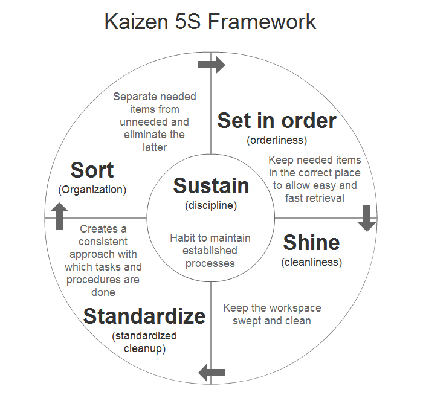
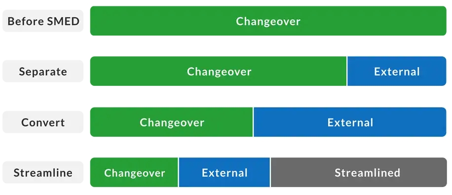

# LEAN

Lean management is a popular approach to run a company based on the concept of continuous improvement. In other words, it is an ongoing effort to refine products, services, or processes, which require “incremental” improvement over time in order to increase efficiency and quality.

The main purpose of lean management is to reduce factors that waste time, effort or money. The only way to manage with it is to analyze a business process and then revise it and cut out every step that does not create value for customers.
Lean Principles

Lean management principles include:

1. Defining value from the standpoint of the end customer.
2. Identifying each step in a business process and eliminating those steps that do not create value.
3. Making the value-creating steps occur in a tight sequence.
4. Repeating the first three steps on a continuous basis until all waste has been eliminated.

These lean principles ensure that production and market launch remain cost-effective.

Lean production or lean manufacturing is a systematic method for the elimination of wastes within a production process. For instance, wastes can be caused by unevenness in workloads, overburden or any work that does not add value. From a customer point of view, “value” is any process or action that he would be willing to pay for. Basically, lean is focus on making obvious what brings value by decreasing everything else.
History of Lean Production

Сertainly, waste reduction has a long history within the manufacturing industry. In fact, lean key concepts have been discovered and rediscovered several times over the years. People were looking for ways to avoid waste. But lean production, as a management philosophy, came mostly from the Toyota Production System (TPS). It was John Krafcik who introduced the term “lean” in the article “Triumph of the Lean Production System” in 1988.  He wrote the article on the basis of his master’s thesis at the MIT Sloan School of Management. Before his studies, Krafcik had worked as a quality engineer in the Toyota-GM NUMMI.

The other important figure was Kiichiro Toyoda. He was the founder of Toyota Motor Corporation. While he directed the engine casting work he found out many problems in their production process. He created the “Kaizen” improvement teams when his processes faced new problems in 1936. Toyota states that the main method of lean is not the tools, but the reduction of three types of waste:

1. muda (“non-value-adding work”)
2. muri (“overburden”)
3. mura (“unevenness”)

This aids in exposing problems systematically and makes it easier to use the right tools where the ideal cannot be achieved. Taiichi Ohno, the Japanese industrial engineer and businessman is considered to be the father of the Toyota Production System. He offered to focus on the reduction of the original Toyota seven wastes to improve the end product.
The Lean Management Tools

Many elements within the concept of lean production stand out and each of these presents a particular method:

1. 5S
2. Kanban (pull systems)
3. Value Stream Mapping
4. SMED
5. Poka-yoke (error-proofing)
6. Elimination of Time Batching
7. Total Productive Maintenance
8. Mixed Model Processing
9. Single Point Scheduling
10. Rank Order Clustering
11. Multi-process Handling
12. Redesigning Working Cells
13. Control Charts (for checking mura)

Some of these methods, such as kaizen and kanban have grown into independent production concepts.

## Kaizen 5S

5S is a perfect way to cope with wastes and increase profitability. The letter “S” stands for 5 words: straighten, sort, standardize, shine, and sustain. Actually, it is a translation from original Japanese words: seiton, seiri, seiketsu, seiso, and shitsuke. These words describe ways of workspace organization for achieving the most efficiency. For instance, identifying and storing the used items, maintaining the items and area, and sustaining the new order.

5S has become a fundamental business measure and a key driver for Kaizen. The 5 Steps are as follows:

1. Sort: Sort out and separate what is needed and not needed within the area.
2. Straighten: Arrange items that are needed so that they are ready and easy to use. Clearly identify a place for each of all items so that anyone can find them and return them once the task is completed.
3. Shine: Clean the workplace and equipment on a regular basis in order to maintain standards and identify defects on time.
4. Standardize: Revisit the first three of the 5S on a frequent basis and confirm the condition of the Gemba using standard procedures.
5. Sustain: Keep to the rules in order to maintain the standard and continuously improve every day.

## Kanban

Needless to say, kanban is one of the best ways to waste reduction. In 1952, Taiichi Ohno invented a kanban system at Toyota, as a system to improve and maintain a high level of production.

Later, Kanban became an effective tool to support a production system as a whole. In addition, it is an excellent way to promote improvement. One of the main benefits of the kanban system is the opportunity to set up an upper limit to the work in progress inventory. It allows to avoid overloading of the production system. Kanban concept of “to do” – “doing” – “done” became the cornerstone of many online tools used for managing projects and control workflows. Kanbanchi is one of such tools that support the Kanban algorithm.

Taiichi Ohno stated that kanban must follow strict rules of use in order to be effective. Toyota, for example, has six simple rules. Close monitoring of these rules is a never-ending task. This ensures that the kanban system does what is required:

1. A Later process picks up the number of items indicated by the kanban at the earlier process.
2. The Earlier process produces items in the quantity and sequence indicated by the kanban.
3. No items are made or transported without a kanban.
4. Always attach a kanban to the goods.
5. Defective products are not sent on to the subsequent process. The result is 100% defect-free goods.
6. Reducing the number of kanbans increases sensitivity.

## Value Stream Mapping

Value stream mapping is a method of lean management that is applicable for almost any value chain. It is used for analyzing the current stage and designing its further stages for the series of events that take a service or product from the beginning through to the client. This method is also applicable to:

1. Logistics
2. Supply Chain
3. Service-Related Industries
4. Healthcare
5. Software Development
6. Product Development
7. Administrative or Office Processes

Value stream mapping usually employs standard symbols to represent items and processes. The best way to create a VSM is to draw with a pencil and on a sheet of A3 paper. The reason is that you will need to make a lot of frequent corrections and changes.

In fact, VSM is a relatively recent addition to the TPS toolbox. Even in the late 1990s, these techniques were for the most part unknown outside of Toyota. Later John Shook and Mike Rother co-authored the book “Learning to See”, published by the Lean Enterprise Institute. This is what made the material and information flow widely accessible for use outside of Toyota.

Certainly, value stream mapping is a flexible tool that lets us put all of the information into one place in a manner that is not possible with process mapping or other tools. Read this article to learn about creating a value stream map.

## SMED

SMED (Single-Minute Exchange of Die) is a system for dramatically reducing the time it takes to complete equipment changeovers. The essence of the SMED system is to convert as many changeover steps as possible to “external” (performed while the equipment is running), and to simplify and streamline the remaining steps. The name Single-Minute Exchange of Die comes from the goal of reducing changeover times to the “single” digits (i.e., less than 10 minutes).

A successful SMED program will have the following benefits:

1. Lower Manufacturing Cost: faster changeovers mean less equipment downtime
2. Smaller Lot Sizes: faster changeovers enable more frequent product changes
3. Improved Responsiveness to Customer Demand: smaller lot sizes enable more flexible scheduling
4. Lower Inventory Levels: smaller lot sizes result in lower inventory levels
5. Smoother Startups: standardized changeover processes improve consistency and quality

SMED was developed by Shigeo Shingo, a Japanese industrial engineer who was extraordinarily successful in helping companies dramatically reduce their changeover times. His pioneering work led to documented reductions in changeover times averaging 94% (e.g., from 90 minutes to less than 5 minutes) across a wide range of companies.

Changeover times that improve by a factor of 20 may be hard to imagine, but consider the simple example of changing a tire:

    For many people, changing a single tire can easily take 15 minutes.
    For a NASCAR pit crew, changing four tires takes less than 15 seconds.

Many techniques used by NASCAR pit crews (performing as many steps as possible before the pit stop begins; using a coordinated team to perform multiple steps in parallel; creating a standardized and highly optimized process) are also used in SMED. In fact, the journey from a 15-minute tire changeover to a 15-second tire changeover can be considered a SMED journey.

In SMED, changeovers are made up of steps that are termed “elements”. There are two types of elements:

    Internal Elements: elements that must be completed while the equipment is stopped
    External Elements: elements that can be completed while the equipment is running

The SMED process focuses on making as many elements as possible external and simplifying and streamlining all elements.
[Further Reading.](https://www.leanproduction.com/smed/)

## Poka-yoke (error-proofing)

The term Poka-Yoke (poh-kah yoh-keh) was coined in Japan during the 1960s by Shigeo Shingo, an industrial engineer at Toyota. Shingo also created and formalized Zero Quality Control – a combination of Poka-Yoke techniques to correct possible defects and source inspection to prevent defects.

Actually, the initial term was baka-yoke, meaning ‘fool-proofing’, but was later changed because of the term’s dishonorable and offensive connotation. Poka-Yoke means ‘mistake-proofing’ or more literally – avoiding (yokeru) inadvertent errors (poka).

Poka-Yoke ensures that the right conditions exist before a process step is executed, and thus preventing defects from occurring in the first place. Where this is not possible, Poka-Yoke performs a detective function, eliminating defects in the process as early as possible.

Poka-Yoke is any mechanism in a Lean manufacturing process that helps to avoid mistakes.

Its purpose is to eliminate product defects by preventing, correcting, or drawing attention to human errors as they occur.

Why is Poka-Yoke Important?

The value of using Poka-Yoke is that they help people and processes work right the first time, which makes mistakes impossible to happen.

These techniques can significantly improve the quality and reliability of products and processes by eliminating defects.

This approach to production fits perfectly the culture of continuous improvement, which is also part of the Lean management arsenal.

It can also be used to fine-tune improvements, and process designs from six-sigma Define – Measure – Analyze – Improve – Control (DMAIC) projects. Applying simple Poka-Yoke ideas and methods in product and process design can eliminate human and mechanical errors.

The flexibility of Poka-Yoke allows for it not to be costly. For example, Toyota’s goal is to implement each mistake-proofing device for under $150. Depending on the size of the company, it can be an extremely cost-efficient endeavor.

When and How to Use it?

Poka-Yoke technique could be used whenever a mistake could occur, or something could be done wrong – meaning everywhere. It can be successfully applied to any type of process in the manufacturing or services industry, preventing all kinds of errors:

1. Processing error: Process operation missed or not performed per the standard operating procedure.
2. Setup error: Using the wrong tooling or setting machine adjustments incorrectly.
3. Missing part: Not all parts are included in the assembly, welding, or other processes.
4. Improper part/item: Wrong part used in the process.
5. Operations error: Carrying out an operation incorrectly; having the incorrect version of the specification.
6. Measurement error: Errors in machine adjustment, test measurement, or dimensions of a part coming in from a supplier.

Poka-Yoke is easy to implement because of its universal and rational nature. You can follow this step by step process to apply it:

1. Identify the operation or process.
2. Analyze the 5-whys and the ways a process can fail.
3. Choose the right Poka-Yoke approach, such as using a shutout type (preventing an error being made) or an attention type (highlighting that an error has been made).
4. Take a comprehensive approach instead of thinking of Poka Yokes just as limit switches or automatic shutoff.
5. Determine whether a contact (use of shape, size, or other physical attributes for detection), constant number (error triggered if a certain number of actions are not made), or a sequencing method (use of a checklist to ensure completing all process steps) is most appropriate.
6. Test the method and see if it works.
7. Train the operator, review performance, and measure success.

## Elimination of Time Batching

This is a step for Muda(Waste reduction).

## Total Productive Maintenance

## Mixed Model Processing
## Single Point Scheduling
## Rank Order Clustering
## Multi-process Handling
## Redesigning Working Cells
## Control Charts (for checking mura)

## PDCA

Plan -> Do -> Check -> Act
