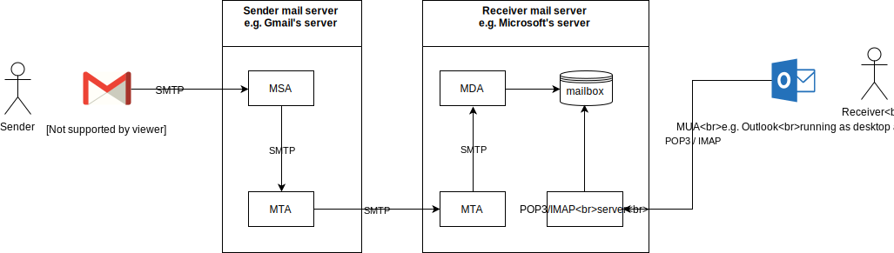

# E-Mailing

E-Mailing is the process of mailing long format messages to people.
Components required by it are :

1. Message Transfer Agent
2. Email Retrieval systems
3. Email Clients

Each component uses a set of protocols in order to achieve what it does.

Message Transfer Agents use SMTP in order to recieve and route mails. Retrieval Systems use POP3 and IMAP for providing access to mails in 2 separate ways to a Client.

Email Servers cannot work without Mail Exchanger records.

## MTA

Message Transfer Agents are servers that utilize  Simple Mail Transfer Protocol in order to route mails. It recieves emails from a message submission agent, and routes it to Mail Delivery Agents, if it belongs to the local address.

Example of MTAs are : 

1. Sendmail
2. Postfix
3. Exim

## IMAP Servers

Internet Message Access Protocol servers help in mail retrieval, from the mailbox, where Mail Delivery Agents deposit the mails.

## Security

Legacy : STARTTLS  
Updated : MTA-STS
