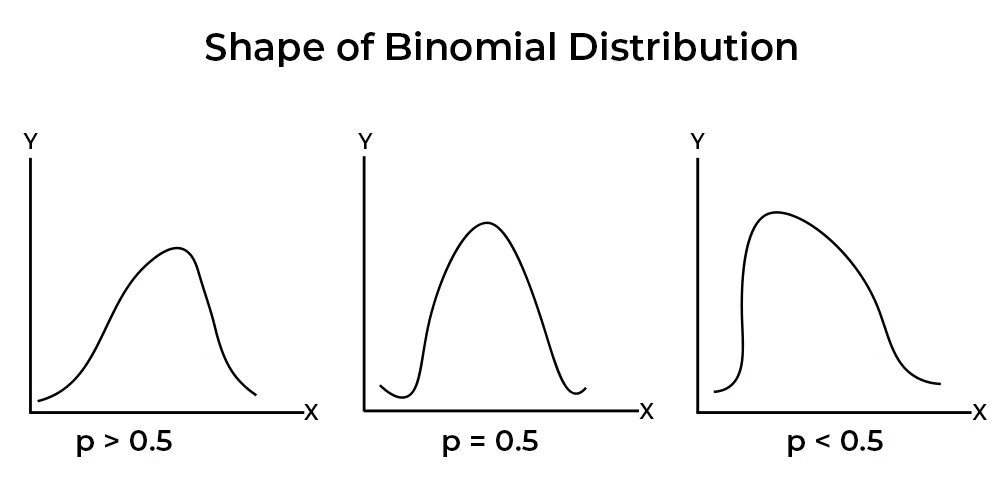
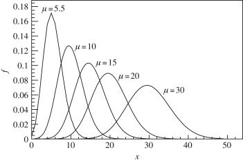

# Distributions in Data Science

## Discrete Distributions
These are used when the variable can take on only specific, separate values (usually counts).

### Binomial Distribution
Use: Models the number of successes in a fixed number of independent Bernoulli trials.

Example: Number of defective items in a batch of 100.

Formula for binomial distribution is

$$ P(X=x) = ^{n}C_x q^{n-x}, x = 0, 1, 2,......,n; 0 < p < 1$$

where,
$P(X=x)$ represents the probability of getting x successes in n experiments,  
$^nC_x$ is the binomial coefficient and is equal to $\frac{n!}{x!(n-x)!}$
$p$ is the probability of success in a single experiment.  
$q$ is the probability of failure in a single experiment, and $q = 1 - p$  
$n$ is the total number of experiments.

Mean: $μ = np$  
Variance: $σ² = npq$

### Poisson Distribution
Use: Models the number of events occurring in a fixed interval of time or space.

Example: Number of calls received at a call center in an hour.

Formula:

$$ P(X=x) = \frac{λ^x e^{-λ}}{x!}, x = 1, 2, 3,.....; λ > 0 $$

where,

$P(x)$ represents the probability of a specific number of events occurring.
$e$ is the mathematical constant approximately equal to 2.7183.
$λ$ is the average rate of event occurrences in the given time or space.

Mean and Variance can be calculated as:
$$ μ  = σ^2 = λ $$

### Geometric Distribution
Use: Models the number of trials until the first success.

Example: Number of coin tosses until the first heads.

### Negative Binomial Distribution
Use: Models the number of trials needed to achieve a specified number of successes.

Example: Number of customers visited until 5 sales are made.

### Hypergeometric Distribution
Use: Models successes in draws without replacement from a finite population.

Example: Number of red balls drawn from a bag without putting them back.

## Continuous Distributions
Used when the variable can take any value in an interval (e.g., time, weight, cost).

### Normal Distribution (Gaussian)
Use: Most commonly used; describes natural phenomena like measurement errors.

Example: Heights of people, test scores.

### Exponential Distribution
Use: Models time between events in a Poisson process.

Example: Time between arrivals at a service point.

### Uniform Distribution
Use: All outcomes in an interval are equally likely.

Example: Time taken for a process that can vary uniformly between 2 and 10 minutes.

### Log-Normal Distribution
Use: Models variables whose logarithm is normally distributed.

Example: Stock prices, income distribution.

### Gamma Distribution
Use: Models waiting times when multiple events are expected.

Example: Time to complete k tasks.

### Beta Distribution
Use: Useful in Bayesian statistics and modeling probabilities themselves.

Example: Estimating the probability of success in project completion.

### Weibull Distribution
Use: Common in reliability and survival analysis.

Example: Failure times of machines or components.

## Other Relevant Distributions

### Multinomial Distribution
Extension of the binomial distribution for multi-category outcomes.

### Chi-Square Distribution
Used in hypothesis testing and confidence interval estimation for variance.

### t-Distribution
Used in small sample statistical inference for means.

### F-Distribution
Used in analysis of variance (ANOVA) and regression.