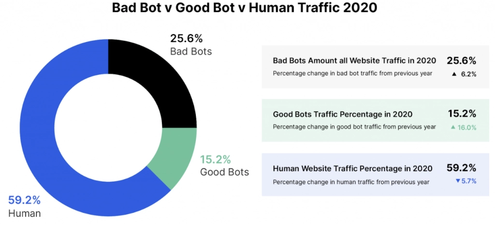

# Automated tool for reporting on metrics for websites(ATROW)

## Requirement

We need a tool that can provide reports on :

1. Space economy
2. Performance Issues visible
3. UX experience of a particular issue
4. Security level checks
5. Competitive leaks

## Importance for businesses

Functional :

1. Increasing user base
2. Quick summary of website status
3. Finding pain points before they become possible pain points

User Base :

1. User Engagement Analysis(How much of the content has visibility and how long do people stay on the items)
2. Ease of operatability and uniformity of content
3. Proactive engagement analysis of creatives(Reinforcement learning based on A/B testing)

Technical :

1. Discoverability of website on popular search engines(SEO metrics required here)
2. Performance load metrics(7 second rule)
3. Security aspects(OSI security)
4. Bot prevention methods

## Current assessing method

1. First load performance metrics from browser inspection
2. Guess of internal tools based on loaded JS scripts
3. Bot prevention analysis, through scrapers testing
4. Security measures visible.

## OSI Model

1. Physical
2. Datalink
3. Network
4. Transport
5. Session
6. Presentation
7. Application

Why important?

Prevention of various financial loses.

## 7 second rule

The 7-Second rule essentially states that you have 7 seconds to

1. capture your visitor's attention
2. Inform your visitors who you are
3. Inform your visitors what you do.

Why important?

Conversion rate.

## SEO

Metrics :

1. New referring domains
2. Domain Authority/domain rating
3. On-page optimization scores
4. Text Readability
5. Impressions
6. Click through rate
7. Keywords ranking
8. Organic visibility
9. Organic Traffic
10. Organic conversions
11. Number of pages indexed
12. Page Speed and Core Web Vitals
13. Pages per visit
14. Crawl errors
15. Bounce rate

Why important?

Increasing user base. Improving user stories.

## Bot prevention

Types :

1. Spider Bots
2. Scraper Bots
3. Spam Bots
4. Social Media Bots
5. Download Bots
6. Ticketing Bots

Metrics :

1. Traffic trends
2. Bounce rate
3. Traffic Sources
4. Server Performance
5. Suspicious IPs and Geo-Locations
6. Language Sources

Methods :

1. CAPTCHA
2. Blacklisting
3. Traffic Distribution analysis
4. Other various techniques

Why important ?

Reducing loads. Decreasing risks. Preventing leaks. Reducing analytical ability of competitors. Increasing website visibility.

## Known tools

1. AscetialTest : Performance metrics and UI testing
2. Selenium : Automated UI testing, Bot prevention effectiveness testing
3. Test Studio : Functional testing, Performance, Load Testing, Mobile testing
4. Lambda Test : Cross platform testing
5. WATIR : Web app testing in Ruby. Automated UI testing
6. Serenity : CI/CD testing pipelines
