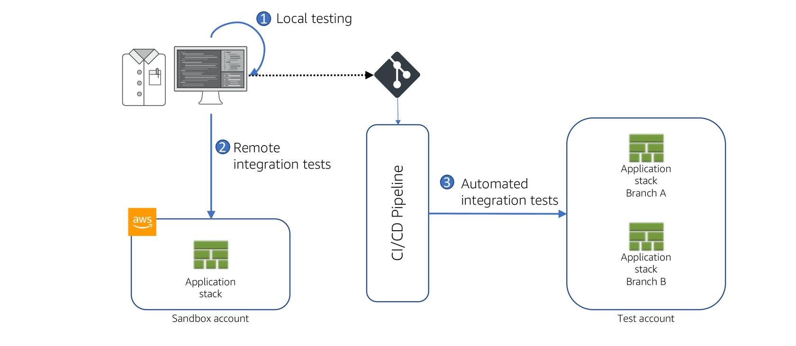

# Serverless Development
 
## Lambda Function

A small executable that can be imagined as a main method in Java.
It has 3 components, which are :

1. Handler
2. Controller
3. Service

A **Handler** should have the **function configuration**, **lambda specific code** and **no business logic**. A **Controller** is for **event processing** and has the **Core Business Logic**. A **Service** contains **external integrations** and **service abstractions**.

It can also be integrated with Libraries and Frameworks. 

A lambda undergoes a cold start followed by a warm start. The order is :

1. Download code and start Execution Context(Cold)
2. Bootstrap the runtime(Cold)
3. Start your code(Hot)


The bootstrap time can be limited by : 

1. Minimizing dependencies
2. Considering startup costs
3. Link compiled librs statically

## AWS SAM(Serverless Application Manager)

ZIPing and Packaging is automated using SAM CLI.
This is made easy by using the following : 

```
sam package
sam deploy
```

So 2 recommendations : 

1. Use Serverless Application Framework
2. Use a SAM template to deploy serverless apps rather than creating one in AWS CloudFormation

## Organizing Lambdas

Service based packaging to be done. Each function should be organized as per the service and each service is given a deployment template and one code repository.

## Structuring Development Environment

1. Create separate AWS accounts for each developer
2. Separate production and non-prod envs into different accounts

## Testing and Debug strategy

Recommended Test Strategy :


Debugging code : 

1. Debugging is not allowed for Lambda Service
2. SAM CLI allows launching a local Docker image with debug strategies
