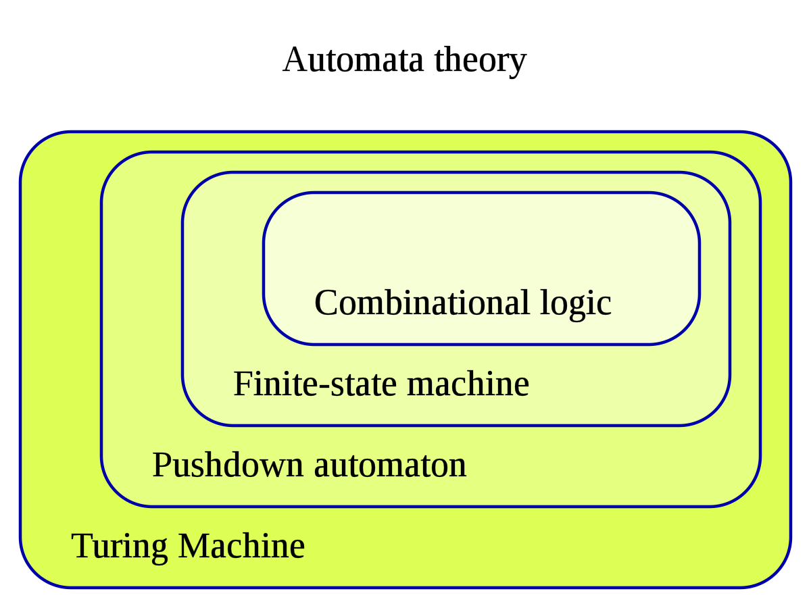

# Automata Theory

It is the study of abstract machines and Automata(relatively self operating machine, designed to automatically follow a predetermined sequence of operations, or respond to predetermined instructions) and of computational problems and how to solve them.

The word automata (the plural of automaton) comes from the Greek word αὐτόματος, which means "self-acting, self-willed, self-moving". An automaton (Automata in plural) is an abstract self-propelled computing device which follows a predetermined sequence of operations automatically. An automaton with a finite number of states is called a Finite Automaton (FA) or Finite-State Machine (FSM).

This is a part of Formal Language Theory.

