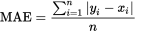
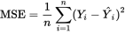
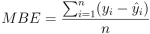
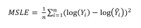
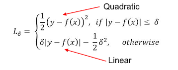
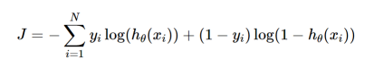
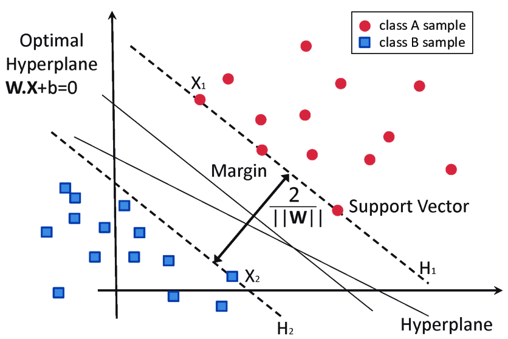
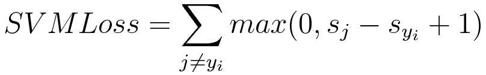
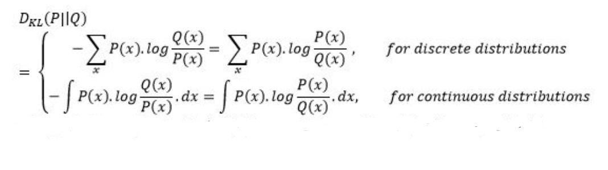

# Loss function

It is a relation of expected outcome to desired outcome,
or the difference between actual to predicted values.

This is however in a broad sense, as the loss functions are more often
used to point at various different aspects.

We see some common loss functions here.

## Loss functions for Regression
### Mean Absolute Error(MAE)

This function is used when we have to find a slope from the origin through a set of points on 2 axis.

The function is given as  :

<!--  -->

This is useful when calculating allocations, in the form of
Quantity Disagreement and Allocation Disagreement.

Allocation Disagreement = MAE - Quantity Disagreement

[Further Reading](https://en.wikipedia.org/wiki/Mean_absolute_error)

### Mean Squared Error(MSE)
Mean Squared Error (also called L2 loss) is almost every data scientist’s preference when it comes to loss functions for regression. This is because most variables can be modeled into a Gaussian distribution.

Mean Squared Error is the average of the squared differences between the actual and the predicted values. For a data point Yi and its predicted value Ŷi, where n is the total number of data points in the dataset, the mean squared error is defined as:

In regression however, n turns into 2 * 'm'.

[Further Reading](https://en.wikipedia.org/wiki/Mean_squared_error)

### Mean Bias Error(MBE)

Mean Bias Error is used to calculate the average bias in the model. Bias, in a nutshell, is overestimating or underestimating a parameter. Corrective measures can be taken to reduce the bias post-evaluating the model using MBE.

Mean Bias Error takes the actual difference between the target and the predicted value, and not the absolute difference. One has to be cautious as the positive and the negative errors could cancel each other out, which is why it is one of the lesser-used loss functions.

The formula of Mean Bias Error is:

### Mean Squared Logarithmic Error(MSLE)

Sometimes, one may not want to penalize the model too much for predicting unscaled quantities directly. Relaxing the penalty on huge differences can be done with the help of Mean Squared Logarithmic Error.

Calculating the Mean Squared Logarithmic Error is the same as Mean Squared Error, except the natural logarithm of the predicted values is used rather than the actual values.

Where yi is the true value, ŷi is the predicted value and ‘n’ is the total number of data points in the dataset.

#### Huber loss

A comparison between L1 and L2 loss yields the following results:

    L1 loss is more robust than its counterpart.

On taking a closer look at the formulas, one can observe that if the difference between the predicted and the actual value is high, L2 loss magnifies the effect when compared to L1. Since L2 succumbs to outliers, L1 loss function is the more robust loss function.

    L1 loss is less stable than L2 loss.

Since L1 loss deals with the difference in distances, a small horizontal change can lead to the regression line jumping a large amount. Such an effect taking place across multiple iterations would lead to a significant change in the slope between iterations.

On the other hand, MSE ensures the regression line moves lightly for a small adjustment in the data point.

Huber Loss combines the robustness of L1 with the stability of L2, essentially the best of L1 and L2 losses. For huge errors, it is linear and for small errors, it is quadratic in nature.

Huber Loss is characterized by the parameter delta (𝛿). For a prediction f(x) of the data point y, with the characterizing parameter 𝛿, Huber Loss is formulated as:

## Loss functions for Classification

### Binary Cross Entropy Loss(BCEL)

This is the most common loss function used for classification problems that have two classes. The word “entropy”, seemingly out-of-place, has a statistical interpretation.

Entropy is the measure of randomness in the information being processed, and cross entropy is a measure of the difference of the randomness between two random variables.

If the divergence of the predicted probability from the actual label increases, the cross-entropy loss increases. Going by this, predicting a probability of .011 when the actual observation label is 1 would result in a high loss value. In an ideal situation, a “perfect” model would have a log loss of 0. Looking at the loss function would make things even clearer :

Where yi is the true label and hθ(xi) is the predicted value post hypothesis.

Since binary classification means the classes take either 0 or 1, if yi = 0, that term ceases to exist and if yi = 1, the (1-yi) term becomes 0.

### Category Cross Entropy Loss(CCEL)

Categorical Cross Entropy loss is essentially Binary Cross Entropy Loss expanded to multiple classes. One requirement when categorical cross entropy loss function is used is that the labels should be one-hot encoded.

This way, only one element will be non-zero as other elements in the vector would be multiplied by zero. This property is extended to an activation function called softmax, more of which can be found in [this article](https://www.section.io/engineering-education/activation-functions/).

### Hinge Loss

Another commonly used loss function for classification is the hinge loss. Hinge loss is primarily developed for support vector machines for calculating the maximum margin from the hyperplane to the classes.

Loss functions penalize wrong predictions and does not do so for the right predictions. So, the score of the target label should be greater than the sum of all the incorrect labels by a margin of (at the least) one.

This margin is the maximum margin from the hyperplane to the data points, which is why hinge loss is preferred for SVMs. The following image clears the air on what a hyperplane and maximum margin is:

The mathematical formulation of hinge loss is as follows:

### Kullback Leibler Divergence Loss(KL Loss)

Kullback Leibler Divergence Loss is a measure of how a distribution varies from a reference distribution (or a baseline distribution). A Kullback Leibler Divergence Loss of zero means that both the probability distributions are identical.

The number of information lost in the predicted distribution is used as a measure. The KL Divergence of a distribution P(x) from Q(x) is given by:

