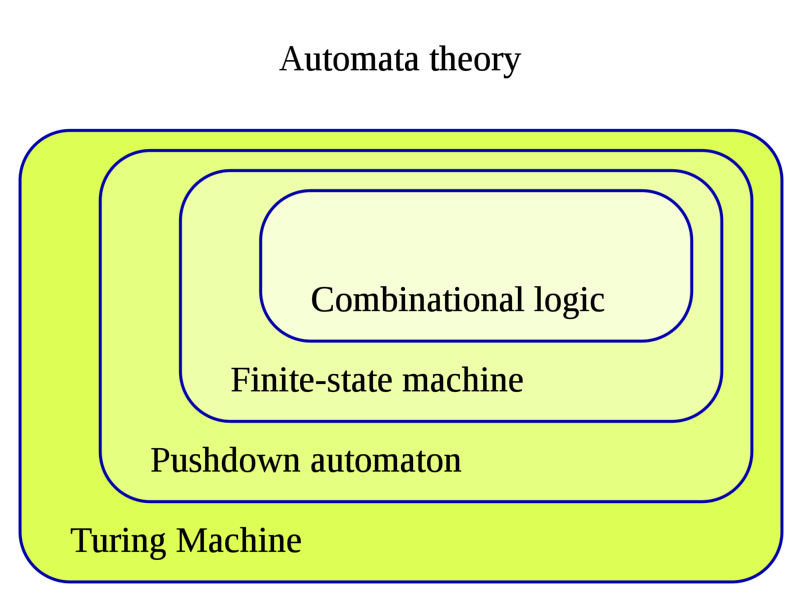

# Automata Theory

It is the study of abstract machines and Automata(relatively self operating machine, designed to automatically follow a predetermined sequence of operations, or respond to predetermined instructions) and of computational problems and how to solve them.

The word automata (the plural of automaton) comes from the Greek word αὐτόματος, which means "self-acting, self-willed, self-moving". An automaton (Automata in plural) is an abstract self-propelled computing device which follows a predetermined sequence of operations automatically. An automaton with a finite number of states is called a Finite Automaton (FA) or Finite-State Machine (FSM).

This is a part of Formal Language Theory.

## Combinational Logic(aka Time-independent logic or combinatorial logic)

A digital logic implemented by boolean circuits, where the output is a pure function of the present input only. This is in contrast to sequential logic, which depends on not only the current, but also the history of inputs, i.e. it has memory.

Combinational logic is used in computer circuits to perform Boolean algebra on input signals and on stored data. Practical computer circuits normally contain a mixture of combinational and sequential logic. For example, the part of an arithmetic logic unit, or ALU, that does mathematical calculations is constructed using combinational logic. Other circuits used in computers, such as half adders, full adders, half subtractors, full subtractors, multiplexers, demultiplexers, encoders and decoders are also made by using combinational logic. 

Boolean Algebra and Logic formula minimization are used for development of boolean logic. Logic Formular minimization example are as follows : 

1. Petrick's method
2. Quine-McCluskey algorithm
3. Espresso heuristic logic minimizer

This uses various types of graphical representations such as : 

1. Euler Diagrams
2. Venn Diagrams
3. Karnaugh Map
4. Binary decision diagram

The optimizations are classified as : 

1. Based on circuit representation
    * 2 level logic optimization
    * multi level logic optimization
2. Based on circuit characteristics
    * sequential logic optimization
    * combinational logic optimization
3. Based on type of execution
    * Graphical optimization methods
    * Tabular optimization methods
    * Algebric optimization methods

## Finite State Machines

A finite-state machine (FSM) or finite-state automaton (FSA, plural: automata), finite automaton, or simply a state machine, is a mathematical model of computation. It is an abstract machine that can be in exactly one of a finite number of states at any given time. The FSM can change from one state to another in response to some inputs; the change from one state to another is called a transition. An FSM is defined by a list of its states, its initial state, and the inputs that trigger each transition. Finite-state machines are of two types : 

1. deterministic finite-state machines
2. non-deterministic finite-state machines

A deterministic finite-state machine can be constructed equivalent to any non-deterministic one.

It has a single state that it keeps.

Representations : 

1. State/Event table
2. UML state machines
3. SDL state machines

Identifies Regular Languages.

### Classification

#### Acceptors

Acceptors (also called detectors or recognizers) produce binary output, indicating whether or not the received input is accepted. Each state of an acceptor is either accepting or non accepting. Once all input has been received, if the current state is an accepting state, the input is accepted; otherwise it is rejected. As a rule, input is a sequence of symbols (characters); actions are not used. The start state can also be an accepting state, in which case the acceptor accepts the empty string. 

#### Classifiers

Classifiers are a generalization of acceptors that produce n-ary output where n is strictly greater than two.

#### Transducers

Transducers produce output based on a given input and/or a state using actions. They are used for control applications and in the field of computational linguistics.

In control applications, two types are distinguished:

##### Moore machine

The FSM uses only entry actions, i.e., output depends only on state. The advantage of the Moore model is a simplification of the behaviour. Consider an elevator door. The state machine recognizes two commands: "command_open" and "command_close", which trigger state changes. The entry action (E:) in state "Opening" starts a motor opening the door, the entry action in state "Closing" starts a motor in the other direction closing the door. States "Opened" and "Closed" stop the motor when fully opened or closed. They signal to the outside world (e.g., to other state machines) the situation: "door is open" or "door is closed".

##### Mealy machine

The FSM also uses input actions, i.e., output depends on input and state. The use of a Mealy FSM leads often to a reduction of the number of states. The example in figure 7 shows a Mealy FSM implementing the same behaviour as in the Moore example (the behaviour depends on the implemented FSM execution model and will work, e.g., for virtual FSM but not for event-driven FSM). There are two input actions (I:): "start motor to close the door if command_close arrives" and "start motor in the other direction to open the door if command_open arrives". The "opening" and "closing" intermediate states are not shown.

#### Sequencers

Sequencers (also called generators) are a subclass of acceptors and transducers that have a single-letter input alphabet. They produce only one sequence, which can be seen as an output sequence of acceptor or transducer outputs.

#### Determinism

A further distinction is between deterministic (DFA) and non-deterministic (NFA, GNFA) automata. In a deterministic automaton, every state has exactly one transition for each possible input. In a non-deterministic automaton, an input can lead to one, more than one, or no transition for a given state. The powerset construction algorithm can transform any nondeterministic automaton into a (usually more complex) deterministic automaton with identical functionality.

A finite-state machine with only one state is called a "combinatorial FSM". It only allows actions upon transition into a state. This concept is useful in cases where a number of finite-state machines are required to work together, and when it is convenient to consider a purely combinatorial part as a form of FSM to suit the design tools.

## Pushdown Automata

A type of automaton that employs a stack. Pushdown automata are used in theories about what can be computed by machines. They are more capable than finite-state machines but less capable than Turing machines. Deterministic pushdown automata can recognize all deterministic context-free languages while nondeterministic ones can recognize all context-free languages, with the former often used in parser design.

Identifies Context-free languages

## Turing Machine

A Turing machine is a mathematical model of computation describing an abstract machine that manipulates symbols on a strip of tape according to a table of rules. Despite the model's simplicity, it is capable of implementing any computer algorithm.

The machine operates on an infinite memory tape divided into discrete cells, each of which can hold a single symbol drawn from a finite set of symbols called the alphabet of the machine. It has a "head" that, at any point in the machine's operation, is positioned over one of these cells, and a "state" selected from a finite set of states. At each step of its operation, the head reads the symbol in its cell. Then, based on the symbol and the machine's own present state, the machine writes a symbol into the same cell, and moves the head one step to the left or the right, or halts the computation. The choice of which replacement symbol to write and which direction to move is based on a finite table that specifies what to do for each combination of the current state and the symbol that is read.

With this model, Alan Turing was able to answer two questions in the negative:

1. Does a machine exist that can determine whether any arbitrary machine on its tape is "circular" (e.g., freezes, or fails to continue its computational task)?
2. Does a machine exist that can determine whether any arbitrary machine on its tape ever prints a given symbol?

## Buchi Automaton

A theoretical machine which either accepts or rejects infinite inputs. Such a machine has a set of states and a transition function, which determines which state the machine should move to from its current state when it reads the next input character. Some states are accepting states and one state is the start state. The machine accepts an input if and only if it will pass through an accepting state infinitely many times as it reads the input. 

Computes omega limit languages.

## Rabin Automaton

A    A Rabin automaton is an ω-automaton A that uses the following acceptance condition, for some set Ω of pairs (Bi,Gi) of sets of states:

> Rabin condition
>
> A accepts exactly those runs ρ for which there exists a pair (Bi,Gi) in Ω such that Bi ∩ Inf(ρ) is empty and Gi ∩ Inf(ρ) is not empty.

Computes omega regular languages.

## Streett Automaton

Streett automaton is an ω-automaton A that uses the following acceptance condition, for some set Ω of pairs (Bi,Gi) of sets of states:

> Streett condition
> 
> A accepts exactly those runs ρ such that for all pairs (Bi,Gi) in Ω, Bi ∩ Inf(ρ) is empty or Gi ∩ Inf(ρ) is not empty.

Computes omega regular languages.

## Parity Automaton

A parity automaton is an automaton A whose set of states is Q = {0,1,2,...,k} for some natural number k, and that has the following acceptance condition:

> Parity condition
> 
> A accepts ρ if and only if the smallest number in Inf(ρ) is even.

Computes omega regular languages.

## Muller Automaton

A Muller automaton is an ω-automaton A that uses the following acceptance condition, for a subset F of P(Q) (the power set of Q):

> Muller condition
> 
> A accepts exactly those runs ρ for which Inf(ρ) is an element of F.
    
Computes omega regular languages.

## Weighted Automaton

In theoretical computer science and formal language theory, a weighted automaton or weighted finite-state machine is a generalization of a finite-state machine in which the edges have weights, for example real numbers or integers. Finite-state machines are only capable of answering decision problems; they take as input a string and produce a Boolean output, i.e. either "accept" or "reject". In contrast, weighted automata produce a quantitative output, for example a count of how many answers are possible on a given input string, or a probability of how likely the input string is according to a probability distribution. They are one of the simplest studied models of quantitative automata.

Computes omega regular languages.

## Others

1. Quantum Finite Automata
2. Geometric Finite Automata
3. Topological Finite Automata
