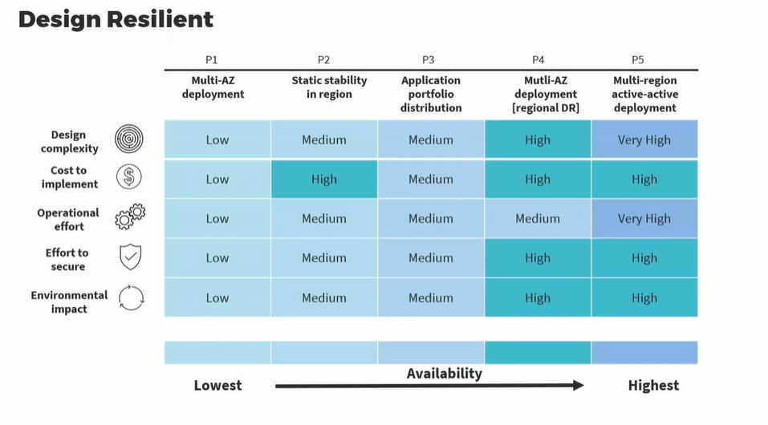

# Data Center Design and Risk Analysis

## Software Defined network

This is defining network topologies using softwares.

We get total separation of the Control Plane and Data plane.

The Control Plane and the SDN controller are what manage the clusters of hypervisors running our applications.

We're also going to use a special type of controller such as Cisco APIC, to actually send the devices in the different planes.

Usually with SDN we're using traditional VLAN or private VLAN, but in a data center we move to a more robust VXLAN(Virtual Extensible LAN environment), with lease switches and spine switches.

SDN solve the problem of having to work with the multitude of OSes, GUIs and lack of centralization, as well as lack of separation between data and control planes.

One other advantage is software defined security. SDS exploits the software-defined networking initiative to enhance network security by tightly controlling the environment,
often using virtualization and terraforming.

The functionality of network security devices,such as the next-gen firewalls, intrusion detection and prevention,IDS, IPS,as well as our identity and access controls and network segmentationare removed from hardware devicesand moved to a logical software layer.Advantages of SDS include the enabling of centralized management of security,which is implemented, controlled, and managed by security softwarethrough the SDN controller.

This is often a special software packagerunning on a Cisco server.It gives you visibility of information provided from one source.It enables resourceful and dynamic countermeasuresto security attacks.It removes securityfrom traditional hardware management vulnerabilitiessuch as SNMP, syslog,Secure Shell version 1, and SSL.You can dynamically configure existing network nodes,while allowing for rapid attack mitigationfrom zero-day attacksor attacks that show up for the first time in the wildthat happen to be on your networkor in your cloud environment.You get a synchronized view of logical security policies,and these exist within the SDN controller module.You can correlate events,and respond more efficiently and intelligently to threatswith security information and event management (SIEM)and security orchestration, automation, and response (SOAR).And SDS facilitates Internet of Things (IoT),and the rapid deployment of BYOD,bring your own device connectivity and security.Modern corporate data centers and cloud data centershave moved away from traditional VLANswith their 12-bit identifieraccommodating 4094 VLANsto the Virtual Extensible LAN, VXLAN.It's an encapsulation protocolthat offers data center connectivity using tunneling,to stretch L2 connections, logical connections,over an existing L3 network.Solutions from vendors decouple the physical hardwarefrom the network mapin order to support virtualization,and allowing the data center network to be deployed programmaticallyusing software-defined networking.It allows both Layer 2 and Layer 3 transportbetween virtual machinesand the underlying type 1 bare-metal servers.VXLAN supports the virtualization of the data center networkwhile still addressing the needs of multi-tenant data centersby offering the necessary scalable segmentation.In other words, now, the VLAN identifier is a 24-bit field.Here's an example of a Cisco network, which is very common,connecting two data centers.These could also be two availability zones in a regiongoing across the IP network.Now, on the exam,you don't have to be familiar with multiprotocol BGP,the COOP program,or even IS-IS, I-S-I-S.But realize what you have here are leaf switches at the bottomand spine switches at the top.And notice there are no trunk ports between the leaf switchesand the spine switches.There's a full mesh.So the things that connect to the leaf switches,for example, your storage area network,your RAID arrays, your hypervisor clusters,they're always only two hops apart.And the protocol connecting the leaf switches and the spine switchesis Intermediate System to Intermediate System.Also, there's no more spanning tree protocolas you have a full mesh.This environment, by the way,is being managed by at least three, preferably five controllersin a cluster.In this example, we have a single clusterof three software-defined network controllers;Cisco calls these APICs or A-P-I-Cs,and instead of connecting to the infrastructure devices,using, let's say, HTTPS, let's say Secure Shell 2or some other management protocol,you're actually sending digitally signed API callsto all of the devices.And since this is being represented logically,it's massively scalable,and you can deploy new leaf switches and spine switchesalmost on demand.And because of the 24-bit identifier field,you can theoretically create as many as 16 million VXLANsin your domain,as opposed to the traditional 4094.Now, that is theoretical.From a practical standpoint you'll see devices from Cisco and Junipersupporting things like 32000 VLANs.You may also be involvedin the logical data center tenant partitioning.This is where your hypervisor clusters come into play.For example, KVM or Citrix Xen, or vSphere,so the operator logs on to the shared server clusterand then in this example we have three tenants.Tenant A, tenant B, tenant C.For example, three large customers of a cloud service provider.They get partitioned into their own partitionsso they have complete separation from each other,and you can see we have their servers runningin their Kubernetes clusters.From a management standpoint,the administrators who log on to the controllersare going to be involved in security management,operating system management,application management,virtualization management of the hypervisor,and the underlying infrastructure management,Physical hardware, the storage area network,and the 100GB network itself.In the multi-tenant model,you can use the same physical hardware and hypervisor solutionto provide multiple virtual hardware solutionsor images to multiple customers.It's important to realize that todaymost cloud providers and enterprise data centersare rapidly moving towards or leveraginga Zero Trust initiative, a Zero Trust model.So let's finish up this lessonlooking at some Zero Trust access controls,which would be digitally signed API sessions.This can be for user access or unity accessto resource objects,or it could be used from a management standpoint.802.1x port-based network access controlat Layer 2 and Layer 3,and 802.1AE MACsec..1x will contribute to your network admission control initiativeand Zero Trust,and .1AE is going to provide encryption, origin authentication,and integrity at the frame level.You'll have biometric multi-factor authentication.For example 2MFA or MFA with fingerprint,ocular scanning, facial recognition, or others.Physical and logical intrusion detection systemswith various sensors and monitors.Visibility in the Security Operations Center or the SOC.And centralized and automated least privilege principlesand separation of duties.

Security standards and protocols of note :

1. AES-256-GCM
2. MACsec(802.1AE)
3. MACsec GMAC
4. IS-IS
5. COOP
6. MP-BGP
7. APIC cluster
8. EVPN

Example setting :

A Storage Area Network(SAN) is made up of quite a few different specialty devices,specialty SAN fabric switches, host bus adapters,dual homing servers, and different types of data arrays.Obviously, at the top of the listwill be implementing a Zero Trust initiative.Then we would use secure management through software-defined security,complete separation of the control plane and the data plane.We would harden all of our switches and servers.We would test our patch management before we deployed the patches.We call that software assurance.We can encrypt data at rest with AES-256-GCM.We would use multi-factor authentication,biometric access to the area, and possibly to different controllers.We would implement 802.1AE (MACsec),that provides encryption and more on the SAN frames.If we dealt with the overhead of encryption, we don't have to do that.We can just use the MACsec GMACto get origin authentication and integrity.

Zero Trust Access Controls

1. Digitally signed API sessions using tokens
2. 802.1x PNAC and 802.1AE MACsec
3. Biometric multi-factor authentication
4. Physical and logical intrusion detection

## Physical Data Center Design

## Environmental Layer

* Content Security Policy Environmental Layer is dedicated to environment considerations from site selection and construction to operations and sustainability
* CSPs carefully choose their data center locations to alleviate environmental risks
* The data center sites are in non-descript locations without logos.

## Resilient Design

A resilient design is the process of designing buildings, facilities,landscapes, campuses, communities,to lower the impact of extreme weather and external threats.Resilient design focuses on practical and realistic solutions,and it's often part of your disaster recoveryor business continuity planning.Here we see five tiers, P1 through P5.

### Uptime Institute

Standard bearer for digital infra. Rates Sites based on Tiers.

- Tier 1 Site - Basic Site infra
    - Simpler, less expensive solution with little or no redundancy(only space for UPS, IT Systems, line conditioning and cooling of critical components)
    - Problematic personnel activity will cause downtime
    - All 4 tiers have at least 12 hours of fuel for generators
- Tier 2 Site - Redundant Site Infrastructure Capacity Components
    - There will be downtime for any disconnection from power distribution and lines
    - Problematic personnel activity *MAY* cause downtime
    - Unplanned component failure or systems *MAY* cause downtime
- Tier 3 Site - Concurrently Maintainable site Infra
    - Dual power supplies for all systems
    - Critical Operations can continue if a single component or power element is down for replacement or scheduled maintenance
    - Unplanned loss of component MAY cause downtime; unplanned loss of sungle system WILL cause downtime
- Tier 4 Site - Fault Tolerant Site Infrastructure
    - Has features of other tiers
    - Full redundancy of systems, power, cooling
    - Loss of a single element will NOT cause downtime
    - Fully automated visibility and response systems
    - Scheduled maintenance performed without downtime

## Cloud Infrastructure Risk Assessment

Risk is defined as :

- Ineherent Risk
- Residual Risk
- Risk Acceptance
- Risk Avoidance
- Risk transference/sharing
- Risk mitigation

Management mechanisms :
- Create a risk register.
- OpenFAIR(Factor Analysis of Information Risk)
- Whitman Quantitative Model
    - Asset Value
    - Exposure Factor
    - Single Loss expectancy = AV x EF
    - Annualized rate of occurance
    - Annualized loss expectancy = SLE x ARO
- CSA Cloud Controls Matrix
    - Evaluates cloud computing deployments
    - Contains 197 control objectives that are organized into 17 separate domains covering all key aspects of cloud tech
    - valuable tool for the methodically assessing a cloud implementation
    - Considered de facto standard for cloud security assurance
- STAR Level 1(current version is CAIQ v4)
    - Offers an industry-accepted way to document what security controls exist in IaaS, PaaS, and SaaS services providing security control transparency

