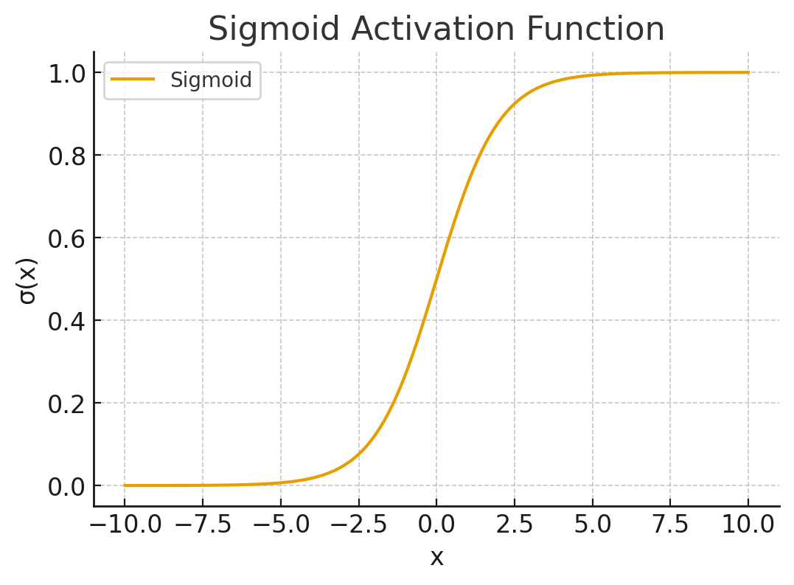
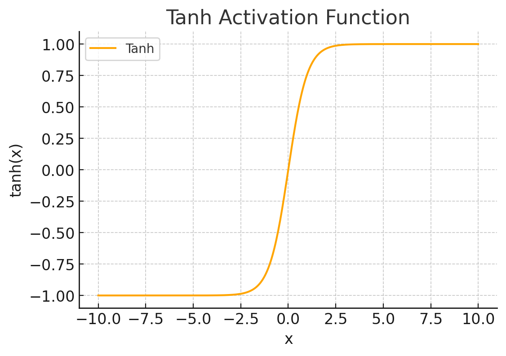
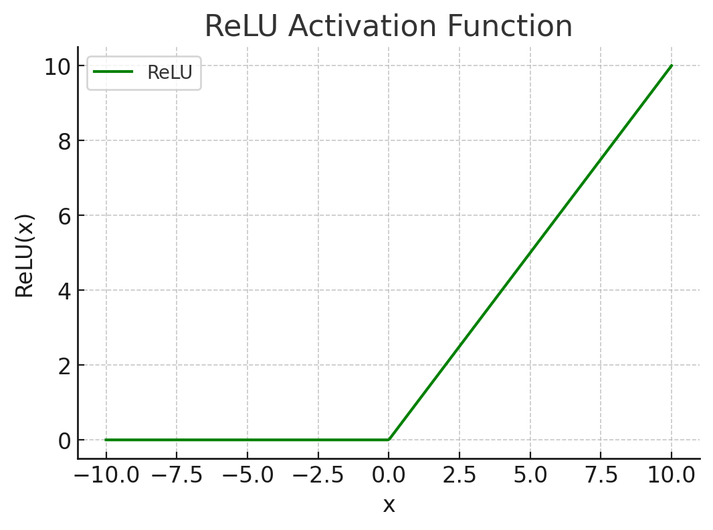
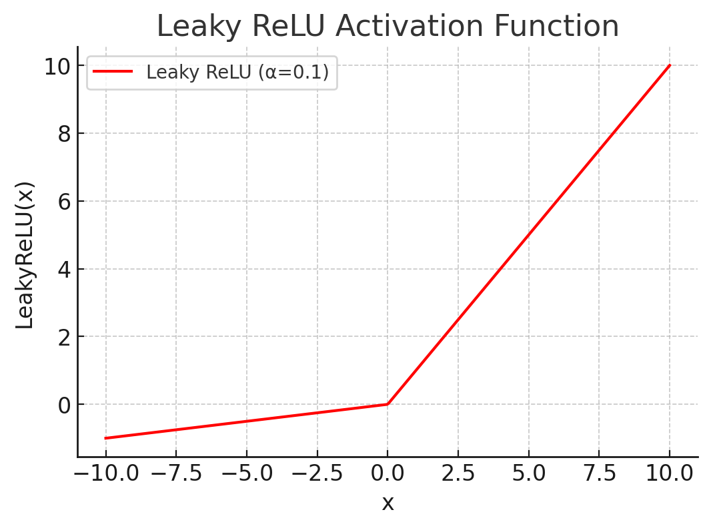
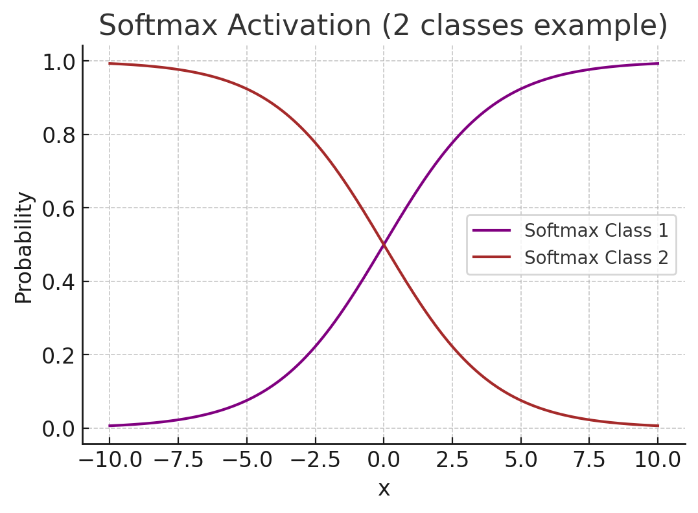

# Artificial Intelligence

* **Artificial Intelligence (AI)**: systems that perform tasks that normally require human intelligence (problem solving, perception, language, planning).
* **Machine Learning (ML)**: a subfield of AI where models learn patterns from data.
* **Deep Learning (DL)**: ML using multi-layer neural networks (high-capacity, representation learning). Textbook-level coverage of DL fundamentals and backpropagation are standard (Goodfellow et al.).

## Classifications (high-level)

* **By approach**

  * **Symbolic / Rule-based AI** (logic, knowledge bases)
  * **Statistical / Probabilistic AI** (Bayesian methods, probabilistic graphical models)
  * **Connectionist (Neural)** (neural networks, deep learning)
* **By learning paradigm**

  * **Supervised learning** — labeled data (classification, regression).
  * **Unsupervised learning** — no labels (clustering, representation learning, density estimation).
  * **Semi-supervised learning** — mix of labeled + unlabeled.
  * **Self-supervised learning** — tasks built from inputs themselves (contrastive, masked-prediction).
  * **Reinforcement learning (RL)** — learning via rewards and environment interaction.

## General tasks / application areas

* **Natural Language Processing (NLP)**: language modeling, translation, Q&A, summarization, sentiment, token classification. (Transformers are dominant.) 
* **Computer Vision (CV)**: classification, detection (object detection), segmentation (semantic/instance), image generation (GANs, diffusion).
* **Speech / Audio**: ASR (speech-to-text), TTS (text-to-speech), speaker identification.
* **Reinforcement Learning / Control**: games, robotics, planning.
* **Recommendation & Search**: ranking, retrieval, embeddings.
* **Generative modeling**: GANs, VAEs, diffusion models (image/audio/text generation).

## What is a neuron? (mathematics + named activation functions)

A single neuron (in feedforward networks) computes a weighted sum of its inputs, applies a bias, then passes that through an **activation function**.

Let input vector $x \in \mathbb{R}^n$, weights $w \in \mathbb{R}^n$, bias $b$. The neuron output:

$$
z = w^\top x + b,\qquad y = \phi(z)
$$

Common activation functions (with equations):

* **Linear (identity)**: $\phi(z)=z$.
* **Sigmoid (logistic)**: $\sigma(z) = \dfrac{1}{1+e^{-z}}$. Useful for binary probabilities; saturates for large |z|.  
    
    
* **Tanh**: $\tanh(z)=\dfrac{e^{z}-e^{-z}}{e^{z}+e^{-z}}$, ranges $(-1,1)$.  
    
    
* **ReLU** (Rectified Linear Unit): $\mathrm{ReLU}(z)=\max(0,z)$.  
    
    
* **Leaky ReLU**: $\mathrm{LReLU}(z)=\max(\alpha z, z)$ (small $\alpha>0$).  
    
    
* **Softmax** (multi-class output): for logits $z_i$,  
    
    

  $$
  \mathrm{softmax}(z)_i=\frac{e^{z_i}}{\sum_{j} e^{z_j}}.
  $$

  Softmax converts arbitrary logits into a probability distribution. 

## **Loss Functions (a.k.a. Cost / Objective functions)**

A **loss function** is a mathematical measure of how well (or poorly) a machine learning model is performing on a given task.

* It **quantifies the difference** between the model’s prediction ($\hat{y}$) and the true target value ($y$).
* During training, the model adjusts its parameters ($\theta$) to **minimize the loss**.
* The “optimization” process (via gradient descent or Adam, etc.) relies on the loss to compute parameter updates.

---

### **1. Why are they important?**

* Define **what “good performance” means** for the task.
* Guide the optimization process (the gradients come from the loss).
* Different tasks need different loss functions (classification ≠ regression ≠ generative).

---

### **2. Common Loss Functions (with equations)**

#### **Regression Losses**

1. **Mean Squared Error (MSE)**

   $$
   \mathcal{L}_{\text{MSE}} = \frac{1}{N}\sum_{i=1}^N (y_i - \hat{y}_i)^2
   $$

   Penalizes large errors more (quadratic).

2. **Mean Absolute Error (MAE)**

   $$
   \mathcal{L}_{\text{MAE}} = \frac{1}{N}\sum_{i=1}^N |y_i - \hat{y}_i|
   $$

   More robust to outliers than MSE.

---

#### **Classification Losses**

1. **Binary Cross-Entropy (Log Loss)**
   For binary labels $t \in \{0,1\}$ and predicted probability $\hat{p}$:

   $$
   \mathcal{L}_{\text{BCE}} = -\frac{1}{N}\sum_{i=1}^N \Big[t_i \log(\hat{p}_i) + (1-t_i)\log(1-\hat{p}_i)\Big]
   $$

2. **Categorical Cross-Entropy** (for multi-class, with one-hot targets $t_{i,k}$):

   $$
   \mathcal{L}_{\text{CE}} = -\frac{1}{N}\sum_{i=1}^N \sum_{k=1}^K t_{i,k} \log(\hat{p}_{i,k})
   $$

   Works together with **Softmax** to model probabilities.

3. **Hinge Loss** (used in SVMs):

   $$
   \mathcal{L}_{\text{hinge}} = \frac{1}{N}\sum_{i=1}^N \max(0, 1 - y_i \cdot \hat{y}_i)
   $$

   Encourages correct classification with a margin.

---

#### **Probabilistic & Generative Losses**

1. **Kullback–Leibler (KL) Divergence**
   Measures difference between two probability distributions $P$ and $Q$:

   $$
   D_{\text{KL}}(P \parallel Q) = \sum_x P(x) \log \frac{P(x)}{Q(x)}
   $$

   (Used in Variational Autoencoders, language modeling, etc.)

2. **Wasserstein Loss** (Wasserstein distance, used in WGANs):
   Provides a smoother distance metric between real and generated distributions.

3. **Negative Log-Likelihood (NLL)**

   $$
   \mathcal{L}_{\text{NLL}} = - \sum_{i=1}^N \log p(y_i \mid x_i;\theta)
   $$

   A general loss form (e.g., for probabilistic models).

---

#### **Reinforcement Learning Losses**

* **Policy Gradient Loss** (REINFORCE):

  $$
  \nabla_\theta J(\theta) = \mathbb{E}_{\pi_\theta} \big[ \nabla_\theta \log \pi_\theta(a \mid s) R \big]
  $$

  (Optimizes expected reward).

* **Temporal Difference (TD) Loss** (for value functions):

  $$
  \mathcal{L}_{\text{TD}} = \big(r + \gamma V(s') - V(s)\big)^2
  $$

---

### **3. Choosing the Right Loss**

* **Regression** → MSE / MAE.
* **Classification** → Cross-entropy.
* **Generative modeling** → KL, Wasserstein, NLL.
* **Reinforcement learning** → Policy gradient / TD error.

## Backpropagation & optimization — core equations

**Gradient descent (batch):**

$$
\theta \leftarrow \theta - \eta \nabla_\theta \mathcal{L}(\theta),
$$

where $\eta$ = learning rate.

**Stochastic Gradient Descent (per mini-batch)** uses same update but gradient estimated on batch.

**Backpropagation**: use chain rule to compute $\frac{\partial \mathcal{L}}{\partial w}$. For a weight $w$ feeding into neuron with pre-activation $z$ and activation $\phi$:

$$
\frac{\partial \mathcal{L}}{\partial w} = \frac{\partial \mathcal{L}}{\partial y}\cdot \phi'(z)\cdot x,
$$

where $x$ is the input to that weight. (High-level chain rule; see Goodfellow for derivations.) 

**Adam optimizer (named algorithm, Kingma & Ba)** — key equations per iteration $t$ (grad $g_t$):

$$
\begin{aligned}
m_t &= \beta_1 m_{t-1} + (1-\beta_1) g_t,\\
v_t &= \beta_2 v_{t-1} + (1-\beta_2) g_t^2,\\
\hat m_t &= \frac{m_t}{1-\beta_1^t},\quad \hat v_t = \frac{v_t}{1-\beta_2^t},\\
\theta_t &= \theta_{t-1} - \eta \frac{\hat m_t}{\sqrt{\hat v_t} + \epsilon}.
\end{aligned}
$$

This is one of the most widely used adaptive optimizers. 

(Also know: **SGD + momentum**, **RMSProp**, etc.)

## Major types of neural networks (what they are, when used)

* **MLP / Feedforward (Fully-connected)**: dense layers, universal function approximator (small/structured data).
* **Convolutional Neural Networks (CNNs)**: local receptive fields, weight sharing — great for images, 2D signals (classification, detection, segmentation).
* **Recurrent Neural Networks (RNNs)**: sequence models (suffer from vanishing gradients).

  * **LSTM** (Long Short-Term Memory) and **GRU**: gating mechanisms to preserve/forget information across long sequences (Hochreiter & Schmidhuber for LSTM).
* **Transformer**: uses self-attention; highly parallelizable and state-of-the-art in NLP and many other domains. Key attention formula (scaled dot-product attention):

  $$
  \mathrm{Attention}(Q,K,V)=\mathrm{softmax}\!\left(\frac{QK^\top}{\sqrt{d_k}}\right)V,
  $$

  where $Q,K,V$ are query/key/value matrices and $d_k$ is key dimension. Transformers replaced recurrence in many sequence tasks. 
* **Graph Neural Networks (GNNs)**: operate on graphs (node/edge features, message passing).
* **Autoencoders (AE) and Variational AE (VAE)**: unsupervised representation learning; VAEs are probabilistic generative models.
* **Generative Adversarial Networks (GANs)**: generator & discriminator in adversarial training (Goodfellow et al.).
* **Diffusion Models**: denoise-from-noise generative models (recently became state-of-the-art for high-quality image generation). (See Ho et al., Sohl-Dickstein et al.) 

## Model creation / training workflow (practical steps & best practices)

1. **Define objective & collect data**

   * Labeling strategy, dataset splits (train / val / test), distribution checks.
2. **Data preprocessing & augmentation**

   * Normalize/standardize inputs, tokenization for text, image augmentations (flip, crop), audio feature extraction.
3. **Model architecture selection**

   * Start small (baseline), increase capacity as needed. Consider transfer learning (pretrained backbones).
4. **Loss function & metrics**

   * Choose loss matching task (CE for classification, MSE for regression). Decide metrics (accuracy, precision/recall/F1, AUC, BLEU, perplexity).
5. **Optimizer & learning-rate schedule**

   * Choose optimizer (Adam common); use LR schedules (step, cosine, warmup). Learning-rate is often the most sensitive hyperparameter.
6. **Regularization**

   * Weight decay (L2), dropout, early stopping, data augmentation, batch norm.
7. **Monitoring & validation**

   * Track train/val loss/metrics. Use held-out test set only for final evaluation.
8. **Hyperparameter tuning**

   * Grid search / random search / Bayesian (Optuna), and practical budgets. Use cross-validation if dataset small.
9. **Model compression & deployment**

   * Quantization, pruning, distillation, converting to inference format (ONNX, TorchScript, TFLite, Core ML). See section 10. 

## Important evaluation metrics (named)

* **Accuracy**: $\frac{\text{correct}}{\text{total}}$ (not reliable for imbalanced sets).
* **Precision / Recall / F1**:

  $$
  \text{Precision}=\frac{TP}{TP+FP},\quad \text{Recall}=\frac{TP}{TP+FN},\quad F1=2\cdot\frac{\text{P}\cdot\text{R}}{\text{P}+\text{R}}.
  $$
* **ROC AUC**: area under ROC curve (sensitivity vs 1-specificity).
* **BLEU** (NLP translation quality), **ROUGE** (summarization), **Perplexity** (language models).
* **mAP** (mean Average Precision) for object detection.

## Model formats & deployment (common formats, when to use them)

* **PyTorch checkpoint (.pt / .pth)** — native PyTorch state_dict or full model. Can be exported to **TorchScript** for C++/mobile inference. (.pt and .pth are basically conventions; both used). 
* **TensorFlow SavedModel** — canonical TensorFlow serialized model (directory with `saved_model.pb` + variables); used for TF Serving and conversions. 
* **ONNX (Open Neural Network Exchange)** — open graph format to move models between frameworks and runtimes (good for deployment and optimizations). 
* **TFLite** — TensorFlow Lite for mobile/embedded, supports post-training quantization and conversion from SavedModel. **Quantization** reduces model size/latency (8-bit, etc.). 
* **Core ML** — Apple’s format for iOS deployment.
* **OpenVINO, TensorRT** — vendor/runtime specific optimizers for Intel/NVIDIA hardware.
* **Model compression techniques**

  * **Quantization**: reduce numeric precision (e.g. float32→int8). Can be post-training or quantization-aware training. 
  * **Pruning**: remove weights/filters with small contribution.
  * **Knowledge distillation**: train a smaller “student” to match a large “teacher”.
  * **Operator fusion / graph optimizations** (runtime dependent).

## Short list of foundational / reference papers & docs (for further reading)

* **“Attention Is All You Need” — Vaswani et al., 2017** (Transformer, attention equation). 
* **“Adam: A Method for Stochastic Optimization” — Kingma & Ba (2014/2015)** (Adam equations). 
* **Deep Learning (Goodfellow, Bengio, Courville)** — textbook (backpropagation, convnets, theory). 
* **ONNX specification & docs** — for model interchange. 
* **TensorFlow SavedModel / TFLite docs** — for TensorFlow model export & quantization. 

## Useful mathematical reminders / cheat-sheet (key equations collected)

* **Neuron forward**: $z=w^\top x + b,\quad y=\phi(z)$.
* **Softmax**: $\mathrm{softmax}(z)_i=\dfrac{e^{z_i}}{\sum_j e^{z_j}}$.
* **Cross-entropy (categorical)**: $\mathcal{L}=-\sum_k t_k \log \hat p_k$.
* **Gradient descent update**: $\theta\leftarrow\theta-\eta\nabla_\theta\mathcal{L}$.
* **Adam**: $m_t=\beta_1 m_{t-1}+(1-\beta_1)g_t,\ v_t=\beta_2 v_{t-1}+(1-\beta_2)g_t^2,$ with bias-corrected $\hat m_t,\hat v_t$ and $\theta\leftarrow\theta-\eta\frac{\hat m_t}{\sqrt{\hat v_t}+\epsilon}$. 
* **Scaled dot-product attention**: $\mathrm{softmax}(QK^\top/\sqrt{d_k})V.$ 

## Cross-check / “what I verified” (short)

I verified and drew from:

* Transformer (attention formula & claims about architecture) — Vaswani et al. (2017). 
* Adam optimizer equations (Kingma & Ba). 
* Softmax & cross-entropy standard forms. 
* ONNX and TensorFlow SavedModel / TFLite docs for model format practices and quantization (deployment & compression). 

Structure :

1. Approaches to AI: Turing Test and Rational Agent Approaches; State Space Representation of Problems, Heuristic Search Techniques, Game Playing, Min-Max Search, Alpha Beta Cutoff Procedures.
2. Knowledge Representation: Logic, Semantic Networks, Frames, Rules, Scripts, Conceptual Dependency and Ontologies; Expert Systems, Handling Uncertainty in Knowledge. 
3. Planning: Components of a Planning System, Linear and Non Linear Planning; Goal Stack Planning, Hierarchical Planning, STRIPS, Partial Order Planning.
4. Natural Language Processing: Grammar and Language; Parsing Techniques, Semantic Analysis and Prgamatics.
5. Multi Agent Systems: Agents and Objects; Agents and Expert Systems; Generic Structure of Multiagent System, Semantic Web, Agent Communication, Knowledge Sharing using Ontologies, Agent Development Tools.
6. Fuzzy Sets: Notion of Fuzziness, Membership Functions, Fuzzification and Defuzzification; Operations on Fuzzy Sets, Fuzzy Functions and Linguistic Variables; Fuzzy Relations, Fuzzy Rules and Fuzzy Inference; Fuzzy Control System and Fuzzy Rule Based Systems.
7. Genetic Algorithms (GA): Encoding Strategies, Genetic Operators, Fitness Functions and GA Cycle; Problem Solving using GA.
8. Artificial Neural Networks (ANN): Supervised, Unsupervised and Reinforcement Learning; Single Perceptron, Multi Layer Perceptron, Self Organizing Maps, Hopfield Network.
