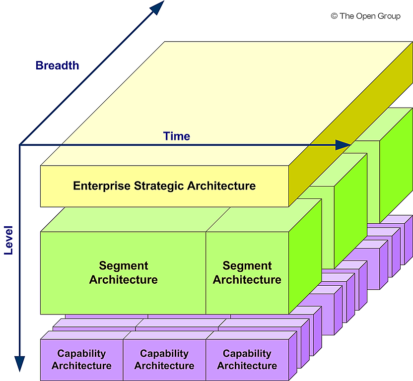
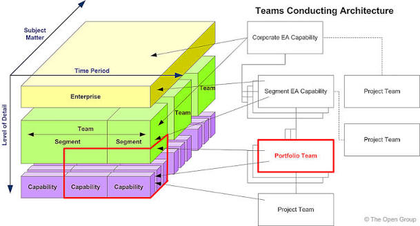
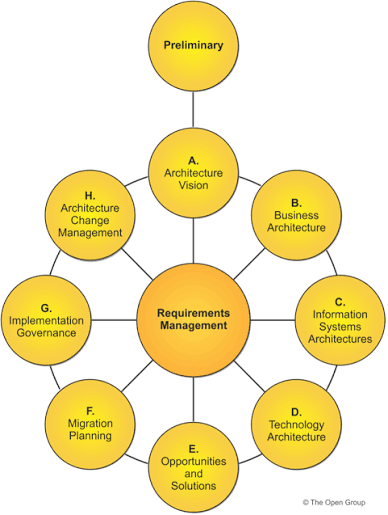
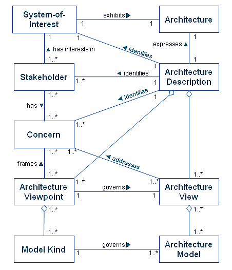

# Introduction

Enterprise - any collection of organizations that have common goals

- one or more specific areas of interest
- may comprise of multiple enterprise
- may include partners, suppliers, customer
- considered as a system
- may develop and maintain several independent Enterprise Architectures

Architecture definitions:

- ISO/IEC/IEEE 42010:2011 - the fundamental concepts or properties of a system, in its environment embodied in it's elements, relationships, and in the principles of it's designs & evolution.
- TOGAF - The structure of components, their interrelationships and the principles and guidelines governing their design & evolution over time.

Purpose of Enterprise Architecture:

- Manages complexity & risks and supports change
- Optimizes processes into an integrated environment that is responsive to change and supportive of the delivery of the business strategy & mission
- Provides enterprises a strategic context for the evolution and reach of digital capability in response to the changing needs of the business environment
- Achieves a balance between business transformation and operational efficiency
- Allows business units to innovate for business goals and competitive advantage
- Enables an integrated strategy with synergies across the enterprise and beyond
- Governs(directs and controls) the change activity to realize the expected value
- Describes the current and future state of an enterprise as well as the gap
- Documents processes around personal data that can be easily understood
- Addresses the end state, performs preference trade-off and value realization for big and little questions

Benefits:

- Better return on existing investment & reduced risk for future investment
- More effective and efficient digital transformation and operations
- More effective strategic decision-making by C-Suite executives & business leaders
- More effective and efficient business operations
- Faster, Simpler and cheaper procurement
- Right balance across conflicting demands

## Architecture Domains

Domains are divided into:

- Business - business strategy, governance, organization and key business processes
    - Artifacts: Business Capability Map, Value Stream Map, Organization Map
- Data - describes the structure of an organization's conceptual, logical & physical data assets, data management resources
    - Artifacts: Data Dissemination diagram, data entity/business function matrix, application/data matrix
- Application - provides blueprint for the individual applications to be deployed, their interactions and their relationships to the core business processes of the organization
    - Artifacts: Application Portfolio Catalog, Application Communication Diagram, Application/Organization Matrix
- Technology - describes the digital architecture and the logical software and hardware infra capabilities and standards that are required to support the deployment of business, data and application services
    - Artifacts: Technology Portfolio Catalog, Platform Decomposition Diagram, Environments & Location Diagram

## Architecture States

- Baseline - current state acting as reference for all change
- Resting - State where the enterprise receives value if all change activity is suspended
- Transition - Fully functional future state that partially realizes targets with a specific time and target conformance
- Candidate - Future state that stakeholders have not approved yet
- Target - Future state that stakeholders have approved

EA manages multiple architecture states.

## Scoping Architecture

4 dimensions that define and limit the scope of an architecture:

- Enterprise Scope(breadth): What is the fill extent of the enterprise and what part of that extent will this architecting effort deal with?
    - Organizations
    - Business Unit
    - Departments
    - Processes
- Level of Detail(depth): To what level of detail should the architecting effort go?
    - How much architecture is "enough"(effort between architecture and system design & development)
- Architecture domains: Which domains should be looked at?
    - Business
    - Data
    - Application
    - Technology
- Time Period: What is the time period that needs to be articulated for the Architecture Vision?
    - Does it make sense to be covered in a detailed architecture description?

## Levels of Architecture Landscape

TOGAF divides Architecture Landscape to 3 levels of granularity.

This is intended to provide an organizing framework for change and operations describing & classifying the landscape.

- Strategic Architecture: Supports direction setting at an executive level
- Segment Architecture: Supports direction setting and the development of architecture roadmaps at a program or portfolio level
- Capability Architecture: Supports the development of effective architecture roadmaps realizing capability increments

### Architecture Partitioning Approach

- Establish several architecture partitions, providng defined boundaries, governance, and ownership
- Apply partitioning to architecture until each architecture has one owning team
- Each team carrying out architecture activity within the enterprise owns one or more architecture partitions and will execute the ADM to define, govern and realize their architectures

Benefits:

- Conflict Management
- Parallelization
- Re-use
- Manageable Complexity & Governance

### Architecture Abstraction Levels

The concept motivates to ask structured questions about an architecture:

- Why is the architecture needed?
- What functionality and other requirements need to be met by the architecture
- How do we structure the functionality?
- With what assets shall we implement this structure?

This helps in divide and conquer.

It divides an architecture effort into 4 distinct levels:

- Contextual Abstraction: Understand the environment of an enterprise and the context of architecture work
- Conceptual Abstration: Understand the problem
- Logical Abstraction: Identify implementation-independent components to achieve the services of the conceptual abstraction
- Physical Abstraction: Find alternatives for allocation and implementation of physical components to meet the logical components

Applying these are called **layering**.

> **NOTE**: One or more Abstraction levels describe the levels of the architecture landscape.

### Building Blocks

- It is a package of functionality defined to meet the business needs across an organization(generally recognizable as "a thing" by domain experts).
- Has normally a type that corresponds to the Enterprise Metamodel
- Can be defined for various levels of detail, depending on the objectives of the enterprise architecture and the architecture development stage
- Can lead to improvements in legacy system integration, interoperability, and flexibility in the creation of new systems and applications

A good building block meets several criterias:
- Considers implementation & usage and evolves to exploit technology & standards
- Is re-usable and replaceable and well specified
- May be assembled from other building blocks
- May interoperate with other, interdependent Building blocks based on a published and stable interface
- Should have defined boundaries and specification which are loosely coupled to it's implementation

#### Special types of building blocks

- Architecture Building Blocks: Architectural components that describe the required capability. May be logical or supplier independent
- Solution Building Blocks: Solution components, that realize the required capability. This is Physical or implementation specific.

ABBs shapes the specification for, and implements the capabilities realized from SBBs.

## The TOGAF Standard

- This is an Enterprise Architecture Framework to develop any kind of architecture in any context
- Developed through collaborative efforts of the community
- Can be applied for a range of use-cases(Ex: Agile Enterprise, Digital Transformation, etc.)
- Describes a standard cycle of change, used to plan, develop, implement, govern, change and sustain an architecture
- Describes the building blocks in an enterprise used to deliver business services & information systems
- Enables organizations to operate in an efficient & effective way using a proven and recognized set of best practices to address business & technology trends
- Enables the organization to build workable & econmic solutions
- Adds value, standardizes & de-risks architecture development
- Results in an Enterprise Architecture that is consistent, reflects the needs of the stakeholders, employs best practices, considers current and future needs of the business.

The standard can and should be tailored to the other frameworks.
- It may adopt elements from other frameworks
- Allows the replacement or extension of it's deliverables by a more specific set
- Allows for the integration of TOGAF methods to other standard frameworks or best practices(Ex: ITIL, COBIT, PRINCE, etc.)
- Should be tailored and integrated into the processes and organization structures
- May be used as a standalone framework

## Architecture Development Method(ADM)

Method that develops & manages the lifecycle of an Enterprise Architecture.

- Core of TOGAF standard
- Tested and repeatable process for developing architectures
- Establishes an architecture framework
- Develops architectures and architecture content
- Interative cycle of continuous architecture definition and realization
- Transforms enterprises in a controlled manner in response to business goals
- Step by Step approach with 10 phases
- each step is divided into steps
- Should be adapted to the needs of the enterprise and to support different architectural styles
- Is not a waterfall method and does not mandate a specific sequence

Phases are:

- Preliminary
    - Preparation and initiation activities required to create an Architecture Capability(Ability of an org to do architecture management)
    - Customize the TOGAF framework
    - Define Architecture Principles
- Phase A: Architecture Vision
    - Initial phase of an architecture development cycle
    - Define the scope of the architecture development initiative
    - Identify the stakeholders
    - Create the Architecture Vision
    - Obtain approval to proceed with the architecture development
- Phase B: Business Architecture
- Phase C: Information Systems Architectures
- Phase D: Technology Architecture
- Phase E: Opportunities and Solutions
    - Conduct initial implementation planning
    - Identify delivery vehicles(programs, projects, or portfolios) for the architecture defined in the previous phases
- Phase F: Migration planning
    - Describe how to move from Baseline to Target
    - Finalize a detailed implementation and migration plan
- Phase G: Implementation Governance
    - Provide an architectural oversight of the implementation
- Phase H: Architecture Change Management
    - Establish procedures for managing change to the new architecture
- Requirements Management
    - Continuous phase that operates the process of managing requirements throughout the ADM
    - Continuous phase for requirements management
    - Ensures that any changes to requirements are handled through appropriate governance processes and are reflected in all other phases

Phases B, C and D are where baseline and target architectures are defined to support the Architecture Vision.

Each phase generates an output. Status of the outputs generated is **defined**. Outputs from an early phase may be modified in a later phase.

### Artifacts

- Catalogs - list of things(Ex: Business Capability Catalog)
- Matrix - relationships between things(Ex: Capability/Organization Matrix)
- Diagrams - Picture of things(Ex: Organization Map)

### Deliverables

- The architectural work products is contractually specified and approved
- It is formally reviewed, approved and signed off by the stakeholders
- Is usually a document
- Represents the output of projects and is archived at completion
- May be transitioned into an Architecture Repository
- Contains several Artifacts & should be versioned
- Deliverables can be Draft and Approved. **Note** Approved does not mean finalized, and is subject to change

> Special Terms: Viewpoint represents where you are looking from on a system whereas View represents what you see of a system