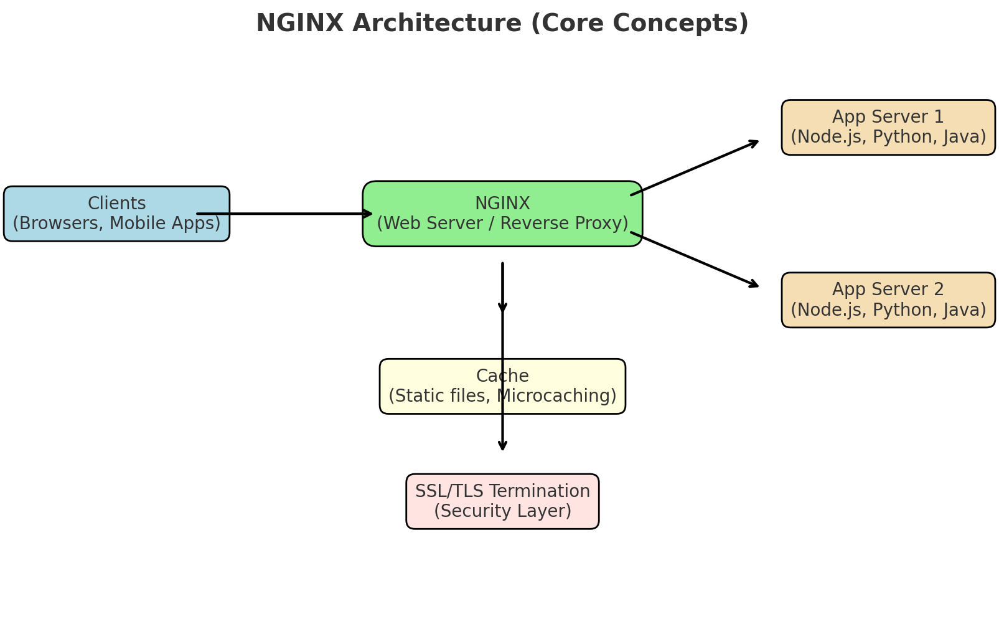

# NGINX

**NGINX** (pronounced *“engine-x”*) is an open-source, high-performance web server that also functions as a **reverse proxy**, **load balancer**, and **HTTP cache**.

It’s widely used to serve static content, manage large volumes of concurrent connections, and act as a gateway in modern web architectures (e.g., microservices, APIs).

NGINX is known for its:

* **Event-driven, asynchronous architecture** (handles thousands of connections efficiently).
* **Low memory usage** compared to traditional web servers like Apache.
* **Versatility**: it can serve static files, terminate SSL/TLS, act as an API gateway, or load-balance traffic across services.

Today, it powers a huge portion of the modern internet — including sites like Netflix, Airbnb, Dropbox, and many others.

---

## **History of NGINX**

* **2002** → Igor Sysoev (a Russian software engineer) started developing NGINX to solve the **C10k problem** — the challenge of handling 10,000+ simultaneous client connections efficiently, which was difficult for traditional thread-based servers like Apache HTTP Server.

* **2004** → NGINX was first publicly released under the **BSD license**.

* **2000s–2010s** → It quickly grew in adoption because of its lightweight design, speed, and scalability. Major companies like Netflix, WordPress, and GitHub adopted it.

* **2011** → NGINX, Inc. was founded to provide commercial support and enterprise features.

* **2019** → F5 Networks (a U.S.-based application services and security company) acquired NGINX, Inc. for **\$670 million**, expanding its role in cloud, API management, and security.

* **Today** → NGINX exists in two main forms:

  * **NGINX Open Source** → Free, community-supported version.
  * **NGINX Plus** → Paid enterprise version with advanced features (monitoring, dynamic configuration, extended load balancing).

## **Core Concepts of NGINX**

### 1. **Event-Driven Architecture**

* NGINX is **asynchronous** and **event-driven**, meaning it uses a small number of worker processes that can each handle thousands of concurrent connections.
* Instead of creating a new thread or process per request (like Apache), NGINX reuses workers and relies on **non-blocking I/O**.
* This makes it very efficient and lightweight, even under heavy load.

---

### 2. **Master and Worker Processes**

* **Master process** → Handles configuration, startup, and managing workers.
* **Worker processes** → Actually handle client requests (HTTP, TCP, UDP).
* You can configure the number of workers (often equals the number of CPU cores).

---

### 3. **Configuration (nginx.conf)**

* NGINX is configured via a single file, usually `/etc/nginx/nginx.conf`.
* Structure is **directive-based** and hierarchical:

  * **Main context** (global settings like worker processes).
  * **Events context** (connection handling).
  * **HTTP context** (web server, reverse proxy, caching, etc.).
  * **Server blocks** → Virtual hosts (like Apache’s vhosts).
  * **Location blocks** → Match specific request URIs for routing.

---

### 4. **Web Server**

* NGINX can serve **static files** (HTML, images, CSS, JS) directly from disk with high performance.
* Acts as a **content delivery tool** for static assets.

---

### 5. **Reverse Proxy**

* One of NGINX’s most powerful features.
* It can sit in front of application servers (Node.js, Python, Java, etc.), receive client requests, and **forward them** to backend services.
* Supports **load balancing**, SSL termination, and protocol translation.

---

### 6. **Load Balancing**

NGINX can distribute incoming requests across multiple backends to ensure scalability and availability.
Load balancing methods include:

* **Round Robin** (default).
* **Least Connections** (send new requests to the server with the fewest active connections).
* **IP Hash** (stick a client to the same backend).
* With **NGINX Plus** → additional health checks and advanced algorithms.

---

### 7. **Caching**

* NGINX can cache responses from backend servers and serve them directly to clients, reducing backend load and improving performance.
* Supports micro-caching (caching for just a few seconds for dynamic content).

---

### 8. **SSL/TLS Termination**

* NGINX can handle HTTPS encryption/decryption so backend services don’t have to.
* Supports HTTP/2, OCSP stapling, and modern TLS configurations.

---

### 9. **Gzip & Brotli Compression**

* Can compress responses before sending them to clients to save bandwidth.

---

### 10. **Security Features**

* **Access control** (by IP, subnets).
* **Rate limiting & request throttling**.
* **Web Application Firewall (WAF)** → via NGINX Plus or third-party modules like ModSecurity.
* **DoS/DDoS mitigation** (basic rate limiting, connection limiting).

---

### 11. **Modules and Extensibility**

* Core features are modular (compiled in).
* Supports dynamic modules (e.g., GeoIP, image filtering, Lua scripting via OpenResty).

---

### 12. **Mail Proxy and TCP/UDP Proxy**

* Beyond HTTP, NGINX can proxy **SMTP, IMAP, POP3** mail protocols.
* It can also act as a generic **TCP/UDP proxy** (for databases, DNS, custom protocols).

---

### 13. **Observability**

* Built-in **access logs** and **error logs**.
* Metrics and status via the **stub\_status module** or advanced dashboards (NGINX Plus has real-time monitoring).

---

### 14. **High Availability**

* Supports clustering and failover when combined with tools like **Keepalived** or **HAProxy**.



## **Configuring NGINX**

# **1. NGINX Directories and Files**

When you install NGINX (via package manager or from source), it creates a standard directory layout. On **Linux (Ubuntu/Debian, CentOS, etc.)**, the key paths are:

---

### **Main Directories**

* **`/etc/nginx/`** → Main configuration directory.

  * **`nginx.conf`** → Main configuration file.
  * **`conf.d/`** → Extra configuration files, usually auto-included in `nginx.conf`.
  * **`sites-available/`** → Configuration for virtual hosts (not always present, but common in Debian/Ubuntu).
  * **`sites-enabled/`** → Symlinks to enabled sites from `sites-available/`.
  * **`modules-enabled/`** → Enabled dynamic modules.

* **`/usr/sbin/nginx`** → The main NGINX binary (executable).

* **`/var/log/nginx/`** → Logs.

  * **`access.log`** → Request logs.
  * **`error.log`** → Errors during operation.

* **`/var/www/`** → Default document root (where your website files live).

  * Example: `/var/www/html/index.html`.

* **`/var/cache/nginx/`** → Cache storage (if caching is enabled).

* **`/run/nginx.pid`** → Process ID file for the master NGINX process.

---

### **Configuration File Structure**

The main config file is usually:
**`/etc/nginx/nginx.conf`**

Its structure looks like this:

```nginx
user www-data;
worker_processes auto;
pid /run/nginx.pid;
events {
    worker_connections 1024;
}

http {
    include       /etc/nginx/mime.types;
    default_type  application/octet-stream;

    # Logging
    access_log /var/log/nginx/access.log;
    error_log /var/log/nginx/error.log;

    # Load all conf.d/*.conf files
    include /etc/nginx/conf.d/*.conf;

    # Virtual hosts (Debian/Ubuntu convention)
    include /etc/nginx/sites-enabled/*;
}
```

---

# **2. Workflow of Configurations**

* **`nginx.conf`** → Loads global settings.
* **`conf.d/*.conf`** → Drop-in configs (e.g., load balancing, caching rules).
* **`sites-available/`** → Holds site-specific configs (virtual hosts).
* **`sites-enabled/`** → Active sites (symlinked from `sites-available/`).

This makes it easy to manage multiple websites on one server.

---

# **3. Key Commands**

After modifying configs, you’ll interact with NGINX like this:

```bash
# Test configuration for syntax errors
nginx -t

# Start NGINX
sudo systemctl start nginx

# Stop NGINX
sudo systemctl stop nginx

# Reload config without downtime
sudo systemctl reload nginx

# Enable NGINX to start at boot
sudo systemctl enable nginx

# Check status
sudo systemctl status nginx
```

---

# **4. First Test Setup**

1. Edit the default site config:

   ```bash
   sudo nano /etc/nginx/sites-available/default
   ```

   Example minimal server block:

   ```nginx
   server {
       listen 80;
       server_name mysite.com www.mysite.com;

       root /var/www/mysite;
       index index.html;

       location / {
           try_files $uri $uri/ =404;
       }
   }
   ```

2. Create site folder:

   ```bash
   sudo mkdir -p /var/www/mysite
   echo "<h1>Hello from NGINX!</h1>" | sudo tee /var/www/mysite/index.html
   ```

3. Enable site (Ubuntu/Debian):

   ```bash
   sudo ln -s /etc/nginx/sites-available/mysite /etc/nginx/sites-enabled/
   ```

4. Test config & reload:

   ```bash
   sudo nginx -t
   sudo systemctl reload nginx
   ```

Now, `http://mysite.com` should serve your page.


Great questions 👌 Let’s do this in **two parts**:

---

# **1. Setting up NGINX as a Reverse Proxy**

A **reverse proxy** means NGINX sits between clients and backend servers, forwarding requests to them.

### Example: Proxy to an App Server (Node.js on port 3000)

Create a new server block:

```ini
server {
    listen 80;
    server_name myapp.com;

    location / {
        proxy_pass http://127.0.0.1:3000;
        proxy_http_version 1.1;

        # Pass headers to backend
        proxy_set_header Upgrade $http_upgrade;
        proxy_set_header Connection 'upgrade';
        proxy_set_header Host $host;
        proxy_cache_bypass $http_upgrade;
    }
}
```

Steps:

1. Save this as `/etc/nginx/sites-available/myapp`.
2. Link it to `sites-enabled`:

   ```bash
   sudo ln -s /etc/nginx/sites-available/myapp /etc/nginx/sites-enabled/
   ```
3. Test & reload:

   ```bash
   sudo nginx -t
   sudo systemctl reload nginx
   ```

Now NGINX listens on **port 80** and forwards requests to your backend server.

---

# **2. Sending JSON Logs to Splunk**

### Step 1: Define a JSON log format

Edit `/etc/nginx/nginx.conf` (inside the `http` block):

```nginx
http {
    log_format json_combined escape=json
        '{'
            '"time_local":"$time_local",'
            '"remote_addr":"$remote_addr",'
            '"request":"$request",'
            '"status":$status,'
            '"body_bytes_sent":$body_bytes_sent,'
            '"http_referer":"$http_referer",'
            '"http_user_agent":"$http_user_agent",'
            '"request_time":$request_time,'
            '"upstream_response_time":"$upstream_response_time",'
            '"upstream_addr":"$upstream_addr"'
        '}';

    access_log /var/log/nginx/access_json.log json_combined;
}
```

### Step 2: Restart or reload NGINX

```bash
sudo nginx -t
sudo systemctl reload nginx
```

Now NGINX writes logs in JSON format at `/var/log/nginx/access_json.log`.

---

### Step 3: Send logs to Splunk

There are multiple ways:

* **Using Splunk Universal Forwarder**
  Install the Splunk UF agent and configure it to monitor `/var/log/nginx/access_json.log`.

* **Using syslog / HTTP Event Collector (HEC)**
  Forward logs via syslog to Splunk or configure an agent (like Fluentd, Filebeat, or Vector) to ship them via HTTP to Splunk’s HEC endpoint.

Example `inputs.conf` for Splunk UF:

```ini
[monitor:///var/log/nginx/access_json.log]
sourcetype = nginx:json
index = web_logs
```

Splunk will then parse JSON fields automatically (if sourcetype is set to `json` or you configure field extractions).
