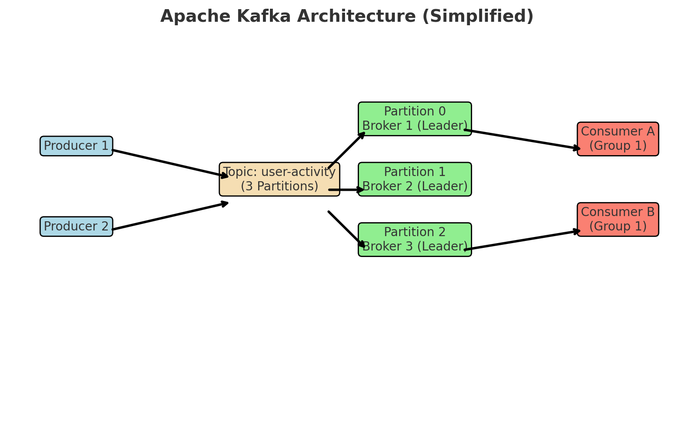

# Apache Kafka

Apache Kafka is a **distributed event streaming platform** used for:

- **Publish/subscribe messaging** (like a message bus).
- **High-throughput event streaming** (millions of events/sec).
- **Real-time data pipelines** (connecting systems reliably).
- **Stream processing** (processing data as it arrives).

It’s designed for **scalability, fault tolerance, and durability** — making it a backbone for modern data-driven applications (e.g., real-time analytics, log aggregation, IoT, financial transactions, etc.).

---

## History

- **2010** → Originally developed at **LinkedIn** to handle massive amounts of log and event data.
- **2011** → Open-sourced under the **Apache Software Foundation** (ASF) as an incubator project.
- **2012** → Graduated to a **top-level Apache project**.
- **2014** → **Confluent** founded by Kafka’s creators (Jay Kreps, Neha Narkhede, Jun Rao) to provide commercial support and an extended ecosystem.
- **2018 onwards** → Evolved beyond messaging into a full **event streaming platform**, with Kafka Streams API, Kafka Connect, and support for exactly-once semantics.
- **Today** → Widely adopted by companies like Netflix, Uber, Airbnb, and banks for mission-critical, real-time data infrastructure.

---

## Why It Became Popular

- Handles **very high throughput** with low latency.
- Distributed and fault-tolerant by design.
- Decouples **data producers** and **consumers**.
- Supports **real-time + batch** use cases.
- Active open-source community + commercial ecosystem (Confluent).

Got it 👍 — let’s break down the **core concepts of Apache Kafka**, what they mean, and how they’re used in practice.

---

## Core Concepts

### 1. **Producer**

- **What it is**: An application that **writes (publishes) messages** (events) to Kafka.
- **About**: Producers send data to specific **topics**. They decide which **partition** the data goes to (round-robin, key-based, or custom logic).
- **How to use**:

  - In Java: `KafkaProducer<String, String>` API.
  - In CLI: `kafka-console-producer.sh`.
  - Example: A web app producing user activity logs to a Kafka topic.

---

### 2. **Consumer**

- **What it is**: An application that **reads (subscribes) to messages** from Kafka topics.
- **About**: Consumers belong to a **consumer group**. Each message is delivered to exactly one consumer in a group (for load balancing).
- **How to use**:

  - In Java: `KafkaConsumer<String, String>` API.
  - In CLI: `kafka-console-consumer.sh`.
  - Example: Analytics service consuming logs from the same topic.

---

### 3. **Topic**

- **What it is**: A **named stream of messages** (like a category/feed).
- **About**:

  - Topics are split into **partitions** for parallelism.
  - Data in a topic is **append-only** and retained for a configurable period (even after being read).

- **How to use**:

  - Create a topic: `kafka-topics.sh --create --topic user-activity`.
  - Publish to it with a producer, read from it with a consumer.

---

### 4. **Partition**

- **What it is**: A **unit of parallelism** inside a topic.
- **About**:

  - Each topic has one or more partitions.
  - Each partition is an **ordered, immutable sequence of records**.
  - Messages are identified by an **offset** (a unique ID within the partition).

- **How to use**:

  - Decide partition count when creating the topic.
  - Use **keys** to control which partition an event goes to (ensures order for related events).

---

### 5. **Offset**

- **What it is**: A unique **sequential ID** for each message within a partition.
- **About**:

  - Consumers track offsets to know what they’ve read.
  - Stored in Kafka (in the `__consumer_offsets` topic).

- **How to use**:

  - By default, Kafka commits offsets automatically.
  - You can manually commit offsets for more control.

---

### 6. **Broker**

- **What it is**: A **Kafka server** that stores data and serves producers/consumers.
- **About**:

  - A Kafka cluster is made up of multiple brokers.
  - Brokers replicate data for fault tolerance.

- **How to use**:

  - Start a broker with `kafka-server-start.sh`.
  - Connect producers and consumers to it using its host\:port.

---

### 7. **Cluster**

- **What it is**: A group of brokers working together.
- **About**:

  - Provides scalability and fault tolerance.
  - One broker acts as the **controller** (manages partitions, leaders).

- **How to use**:

  - Run multiple brokers on different machines/ports.
  - Clients automatically discover cluster members.

---

### 8. **Replication**

- **What it is**: Copying partitions across multiple brokers.
- **About**:

  - Each partition has a **leader** (handles reads/writes) and **followers** (replicas for backup).
  - If a broker fails, a follower takes over.

- **How to use**:

  - Configure replication factor when creating a topic.
  - Example: `--replication-factor 3`.

---

### 9. **ZooKeeper** (Legacy, being replaced by KRaft)

- **What it is**: Coordination service used in older Kafka versions.
- **About**: Stores cluster metadata (brokers, topics, partitions).
- **How to use**:

  - Required for older Kafka (< 2.8).
  - Newer Kafka versions use **KRaft mode** (no ZooKeeper).

---

### 10. **Kafka Streams / Connect**

- **Kafka Streams**: A Java API for **processing data streams** directly from topics (e.g., filtering, joining, aggregating).
- **Kafka Connect**: A framework for **integrating Kafka with external systems** (databases, S3, Elasticsearch, etc.) using connectors.

---

### Kafka Concepts in Action (Example)

Imagine **user activity tracking** at LinkedIn:

1. A **producer** (website backend) publishes click events to the **topic** `user-activity`.
2. The topic has **3 partitions**, so events are spread across brokers.
3. Each event gets an **offset** within its partition.
4. A group of **consumers** (analytics services) reads from the topic in parallel.
5. Data is replicated across brokers → fault tolerance.
6. A **Kafka Streams** app aggregates clicks per user in real time.
7. A **Kafka Connect** sink connector pushes results to a database or dashboard.



## Sample setup of a resilient Kafka cluser(user activity tracking)

Absolutely—here’s a pragmatic, production‑tilted, step‑by‑step for building a **resilient Kafka cluster** for a **“user activity tracking”** pipeline. I’ll focus on modern Kafka (KRaft mode, no ZooKeeper), show the **architecture at each stage**, and include the exact **commands/configs** you can run.

---

### What we’re building (at a glance)

**Target production layout (highly available):**

```
            ┌──────────────────────────┐
            │   Controller Quorum      │  (KRaft metadata)
            │  3 dedicated controllers │  ctrl1, ctrl2, ctrl3
            └───────────┬──────────────┘
                        │
        ┌───────────────┴────────────────┐
        │          Kafka Brokers         │  3+ brokers across AZs
        │   brk1 (rack=a), brk2 (=b),    │
        │   brk3 (=c)  ...               │
        └───────────────┬────────────────┘
                        │
       ┌────────────────┴───────────────────┐
       │          User Activity Topics      │
       │  user-activity.raw (RF=3, P=24)    │
       │  user-activity.sessions (compact)  │
       └────────────────┬───────────────────┘
                        │
   ┌────────────────────┴────────────────────┐
   │ Producers (web/app)  →  Consumers (analytics/ETL) │
   │  acks=all + idempotent                          │
   └──────────────────────────────────────────────────┘

   Optional surrounding services:
   - Kafka Connect (sinks to DW/OLAP/ES/S3)
   - Schema Registry (Avro/Protobuf/JSON Schema)
   - Monitoring (Prometheus JMX exporter + Grafana)
```

**Why KRaft & Java 17?** Kafka 4.x runs **without ZooKeeper** and requires **Java 17**. ([Apache Kafka][1], [docs.confluent.io][2])

---

### Prereqs & planning

- **Nodes**: 3 **controllers** + 3 (or more) **brokers** across 3 racks/AZs for strong availability.
- **Networking**: DNS names for all nodes; open controller port (e.g., 9093) only within the cluster; client listeners (e.g., 9092/SSL) reachable by producers/consumers.
- **Disks**: fast SSDs, separate volumes for Kafka logs (e.g., `/var/lib/kafka`).
- **OS**: set `nofile` limits (e.g., 100k+), and ensure `vm.swappiness=1` (typical perf tuning; adjust to house standards).
- **Java**: Install Java 17 runtime. ([Apache Kafka][1])

---

### Install Kafka (tarball layout)

Download the latest 4.x from kafka.apache.org (choose the Scala build you prefer), untar on **all** nodes to `/opt/kafka` and create a data dir:

```bash
# on each node
sudo adduser --system --home /var/lib/kafka --shell /sbin/nologin kafka
sudo mkdir -p /var/lib/kafka
sudo chown -R kafka:kafka /var/lib/kafka
# unpack Kafka to /opt/kafka and chown to kafka user
```

---

### Configure KRaft (controllers & brokers)

We’ll use **dedicated controllers** (production‑friendly). Confluent’s guidance recommends avoiding “combined mode” (broker+controller in one process) outside dev; we’ll keep them separate. ([docs.confluent.io][3])

#### 3.1 Controller configs (e.g., `config/controller.properties`)

Do this on **ctrl1/ctrl2/ctrl3** (adjust hostnames):

```properties
# Node identity
node.id=1                  # 1 on ctrl1, 2 on ctrl2, 3 on ctrl3
process.roles=controller

# Listeners (controller-only)
controller.listener.names=CONTROLLER
listeners=CONTROLLER://0.0.0.0:9093
# Map listener to protocol (PLAINTEXT here; change to SSL later)
listener.security.protocol.map=CONTROLLER:PLAINTEXT

# The 3 controller voters (same on all controllers & brokers)
controller.quorum.voters=1@ctrl1:9093,2@ctrl2:9093,3@ctrl3:9093

# Log dir for metadata
log.dirs=/var/lib/kafka

# (Optional) rack label if controller racks matter for you later
# broker.rack=ctrl-a
```

**Docs**: KRaft quickstart/config shows `process.roles`, controller listeners, and `controller.quorum.voters`. ([docs.confluent.io][4], [Apache Kafka][5])

#### 3.2 Broker configs (e.g., `config/broker.properties`)

On **brk1/brk2/brk3** (adjust hostnames & racks):

```properties
# Node identity
node.id=101                # unique per broker: 101,102,103...
process.roles=broker

# Client + inter-broker listeners
listeners=INTERNAL://0.0.0.0:9092,EXTERNAL://0.0.0.0:9094
advertised.listeners=INTERNAL://brk1:9092,EXTERNAL://brk1.company.com:9094
inter.broker.listener.name=INTERNAL

listener.security.protocol.map=INTERNAL:PLAINTEXT,EXTERNAL:PLAINTEXT

# Reach the controllers (same on all nodes)
controller.quorum.voters=1@ctrl1:9093,2@ctrl2:9093,3@ctrl3:9093

log.dirs=/var/lib/kafka

# Important availability defaults (consider tightening later)
unclean.leader.election.enable=false
num.network.threads=8
num.io.threads=16

# Rack awareness—set per broker for AZ spread
broker.rack=a     # on brk1; brk2=b; brk3=c
```

**Rack awareness** (`broker.rack`) steers replica placement across AZs; Kafka will spread partition replicas by rack during topic creation. ([Medium][6])

---

### Initialize storage (one cluster id, format all nodes)

**Generate a Cluster ID** on any node:

```bash
/opt/kafka/bin/kafka-storage.sh random-uuid
# example output: VsZ7Uo0NS2y9mEJfmrC6KA
```

**Format controllers** (note `--standalone` only once to bootstrap the quorum):

```bash
# on ctrl1 (bootstrap the quorum)
KAFKA_CLUSTER_ID="VsZ7Uo0NS2y9mEJfmrC6KA"
/opt/kafka/bin/kafka-storage.sh format --cluster-id $KAFKA_CLUSTER_ID \
  --standalone \
  --config /opt/kafka/config/controller.properties

# on ctrl2/ctrl3 (join the existing quorum)
KAFKA_CLUSTER_ID="VsZ7Uo0NS2y9mEJfmrC6KA"
/opt/kafka/bin/kafka-storage.sh format --cluster-id $KAFKA_CLUSTER_ID \
  --config /opt/kafka/config/controller.properties \
  --no-initial-controllers
```

**Format brokers**:

```bash
# on each broker
KAFKA_CLUSTER_ID="VsZ7Uo0NS2y9mEJfmrC6KA"
/opt/kafka/bin/kafka-storage.sh format --cluster-id $KAFKA_CLUSTER_ID \
  --config /opt/kafka/config/broker.properties \
  --no-initial-controllers
```

Formatting per node with a single shared Cluster ID is the required KRaft initialization step. ([docs.redhat.com][7])

---

### Start the cluster

**Start controllers first**, then brokers:

```bash
# controllers
/opt/kafka/bin/kafka-server-start.sh -daemon /opt/kafka/config/controller.properties

# brokers
/opt/kafka/bin/kafka-server-start.sh -daemon /opt/kafka/config/broker.properties
```

**Check quorum health**:

```bash
/opt/kafka/bin/kafka-metadata-quorum.sh \
  --bootstrap-controller ctrl1:9093 describe --status
```

You should see voters `[1,2,3]` and a leader id. You can also point to a broker using `--bootstrap-server brk1:9092`. ([docs.confluent.io][3], [DigitalOcean][8])

---

### Secure it (TLS + SASL/SCRAM)

Do this **before** opening to real clients.

#### 6.1 TLS (SSL)

Create keystores/truststores for each node, then flip listener maps to SSL:

```properties
# on controllers (+brokers)
listener.security.protocol.map=INTERNAL:SSL,EXTERNAL:SSL,CONTROLLER:SSL
listeners=CONTROLLER://0.0.0.0:9093
controller.listener.names=CONTROLLER
# ssl.* keystore/truststore settings here (same as classic Kafka SSL)
ssl.keystore.location=/etc/kafka/ssl/kafka.keystore.jks
ssl.keystore.password=*****
ssl.truststore.location=/etc/kafka/ssl/kafka.truststore.jks
ssl.truststore.password=*****
ssl.client.auth=required
```

Kafka’s SSL setup (certs, keystores, and listener mapping) follows the standard procedure. ([docs.confluent.io][3])

#### 6.2 Authentication (SASL/SCRAM)

Enable SCRAM on listeners and create users:

```properties
# on brokers
sasl.enabled.mechanisms=SCRAM-SHA-512
listener.name.internal.sasl.enabled.mechanisms=SCRAM-SHA-512
listener.name.external.sasl.enabled.mechanisms=SCRAM-SHA-512
listener.name.internal.sasl.mechanism.inter.broker.protocol=SCRAM-SHA-512
```

Create credentials (KRaft uses `--bootstrap-server`, no ZooKeeper):

```bash
# create producer user
/opt/kafka/bin/kafka-configs.sh --bootstrap-server brk1:9092 \
  --alter --add-config 'SCRAM-SHA-512=[password=ProdP@ssw0rd]' \
  --entity-type users --entity-name user-producer

# create consumer user
/opt/kafka/bin/kafka-configs.sh --bootstrap-server brk1:9092 \
  --alter --add-config 'SCRAM-SHA-512=[password=ConsP@ssw0rd]' \
  --entity-type users --entity-name user-consumer
```

SCRAM user management via `kafka-configs.sh` against the KRaft cluster is supported. ([docs.redhat.com][7])

**(Optional)** Enable **ACLs** with `authorizer.class.name` (StandardAuthorizer) and set resource‑level permissions for topics, groups, and cluster operations. (See Kafka security docs.) ([docs.confluent.io][3])

---

### Create the “user activity” topics

Design for **throughput + ordering by user**:

- Key events by `user_id` to preserve per‑user order.
- Start with **RF=3**, **min.insync.replicas=2** for durability, and **acks=all** at producers. ([Docker Hub][9])

```bash
# raw firehose, 24 partitions (tune later)
bin/kafka-topics.sh --bootstrap-server brk1:9092 \
  --create --topic user-activity.raw \
  --partitions 24 --replication-factor 3 \
  --config min.insync.replicas=2 \
  --config cleanup.policy=delete \
  --config retention.ms=604800000         # 7 days

# session state (upserts), log compaction enabled
bin/kafka-topics.sh --bootstrap-server brk1:9092 \
  --create --topic user-activity.sessions \
  --partitions 12 --replication-factor 3 \
  --config min.insync.replicas=2 \
  --config cleanup.policy=compact
```

**Rack awareness**: with `broker.rack` set on brokers, replicas will be placed across racks automatically at creation time. ([Medium][6])

Verify:

```bash
bin/kafka-topics.sh --bootstrap-server brk1:9092 --describe --topic user-activity.raw
```

---

### Producer/consumer settings (safe-by-default)

**Producer (Java/CLI):** use **idempotence** + **acks=all**.

```bash
# properties file (producer.properties)
bootstrap.servers=brk1:9092,brk2:9092,brk3:9092
security.protocol=SASL_SSL
sasl.mechanism=SCRAM-SHA-512
sasl.jaas.config=org.apache.kafka.common.security.scram.ScramLoginModule required \
  username="user-producer" password="ProdP@ssw0rd";

acks=all
enable.idempotence=true
retries=2147483647
delivery.timeout.ms=120000
max.in.flight.requests.per.connection=5
```

Produce a sample JSON event (keyed by `user_id`):

```bash
bin/kafka-console-producer.sh \
  --bootstrap-server brk1:9092 \
  --topic user-activity.raw \
  --producer.config producer.properties \
  --property "parse.key=true" --property "key.separator=:"
# paste a few lines:
123:{"event_id":"e1","user_id":"123","type":"pageview","page":"/home","ts":1690890000000}
123:{"event_id":"e2","user_id":"123","type":"click","button":"signup","ts":1690890001000}
```

**Consumer group** (durable):

```bash
# consumer.properties similar to producer (SASL_SSL)
/opt/kafka/bin/kafka-console-consumer.sh \
  --bootstrap-server brk1:9092 \
  --topic user-activity.raw \
  --from-beginning \
  --consumer.config consumer.properties \
  --group ua-realtime-analytics
```

Idempotent produce + `acks=all` + `min.insync.replicas=2` is the classic durability combo. ([Docker Hub][9])

(For exactly‑once stream processing, use transactions via Kafka Streams/producer transactions.) ([Apache Kafka][5])

---

### Quotas (prevent a noisy neighbor)

Throttle abusive clients by `user` or `client-id`:

```bash
# 1 MiB/s read & write cap for a user
bin/kafka-configs.sh --bootstrap-server brk1:9092 \
  --alter --entity-type users --entity-name user-producer \
  --add-config 'producer_byte_rate=1048576'

bin/kafka-configs.sh --bootstrap-server brk1:9092 \
  --alter --entity-type users --entity-name user-consumer \
  --add-config 'consumer_byte_rate=1048576'
```

Kafka supports per-user and per‑client‑id quotas to control throughput. ([docs.confluent.io][4])

---

### Observability (must‑have)

Expose **JMX** and scrape with **Prometheus JMX Exporter**:

```bash
# put jmx_prometheus_javaagent.jar on each node
export KAFKA_OPTS="$KAFKA_OPTS -javaagent:/opt/jmx/jmx_prometheus_javaagent.jar=7071:/opt/jmx/kafka-jmx.yml"

# kafka-jmx.yml can be the example from the JMX exporter repo; includes broker metrics
```

Prometheus JMX exporter is a standard way to collect Kafka metrics. ([docs.confluent.io][10])

You can also watch the metadata quorum health regularly:

```bash
bin/kafka-metadata-quorum.sh --bootstrap-server brk1:9092 describe --status
```

(Shows leader, voters, follower lag, etc.) ([docs.confluent.io][3])

---

### Failure drills & ops you’ll actually run

- **Kill a broker** (`systemctl stop kafka-broker` or kill the process) → produce/consume should continue; leaders re‑elect on surviving replicas. Check ISR and leaders with `kafka-topics --describe`.
- **Kill a controller** → quorum remains up as long as a majority (2/3) alive. Verify `kafka-metadata-quorum ... describe --status`. ([docs.confluent.io][3])
- **Add a broker** → start it, then **rebalance partitions** to use it (Kafka doesn’t auto‑move your data). Use the reassignment tool, or an admin client. (DO tutorial shows the process and caveats.) ([DigitalOcean][8])

---

### Data modeling for “user activity tracking”

- **Raw stream**: `user-activity.raw` (JSON/Avro) with fields: `event_id`, `user_id` (key), `session_id`, `type`, `ts`, `page`, `attrs`.
- **Session state**: `user-activity.sessions` (compacted) keyed by `session_id` → latest session attributes.
- **Retention**: raw 7–14 days; session topic compacted + optional retention.ms to prune ancient data.
- **Schema**: strongly consider a schema registry (Avro/Protobuf) with **BACKWARD** compatibility to evolve safely.

(General Kafka docs on events and Streams basics.) ([Apache Kafka][5])

---

### Moving data out (optional but common)

**Kafka Connect** (distributed) lets you sink user activity to a warehouse, lake, or search/OLAP:

```bash
# start a Connect worker (on separate nodes or alongside brokers)
bin/connect-distributed.sh config/connect-distributed.properties
```

Create a sink connector (example: JDBC sink to Postgres):

```bash
curl -X POST http://connect1:8083/connectors -H 'Content-Type: application/json' -d '{
  "name": "ua-jdbc-sink",
  "config": {
    "connector.class": "io.confluent.connect.jdbc.JdbcSinkConnector",
    "topics": "user-activity.raw",
    "connection.url": "jdbc:postgresql://pg:5432/analytics",
    "connection.user": "etl",
    "connection.password": "*****",
    "auto.create": "true",
    "insert.mode": "upsert",
    "pk.mode": "record_key",
    "key.converter": "org.apache.kafka.connect.storage.StringConverter",
    "value.converter": "org.apache.kafka.connect.json.JsonConverter",
    "value.converter.schemas.enable": "false"
  }
}'
```

Kafka Connect is managed via REST in distributed mode; use the appropriate connector plugin (JDBC here is an example). ([docs.confluent.io][11])

---

### DR across regions (bonus)

For cross‑region disaster recovery, use **MirrorMaker 2** (Connector‑based). You run a dedicated Connect cluster with MM2 source/sink connectors to mirror topics and consumer groups to a remote cluster. (Follow the MM2 docs from Kafka/Confluent.) ([Confluent Community][12])

---

### Small‑team/dev shortcut: Docker Compose (for local proving)

For local tests, you can co‑locate roles (combined mode) in containers. Example tutorials show `apache/kafka:latest` or `confluentinc/cp-kafka` in KRaft combined mode **for development only**. ([Confluent][13], [docs.confluent.io][14])

**Heads‑up:** Combined mode is **not recommended** for production; prefer dedicated controllers as shown above. ([docs.confluent.io][14])

---

### Tuning checklist (quick)

- **Replication**: `replication.factor=3`, `min.insync.replicas=2`; producers `acks=all`, `enable.idempotence=true`. ([Docker Hub][9])
- **Placement**: set `broker.rack` on each broker before creating topics for rack‑aware replica spread. ([Medium][6])
- **Security**: TLS everywhere; SCRAM or mTLS; lock down controllers to internal network only. ([docs.confluent.io][3])
- **Quotas**: per‑user/client throttles. ([docs.confluent.io][4])
- **Monitoring**: JMX exporter + Grafana dashboards; watch ISR, under‑replicated partitions, request latency, controller quorum status. ([docs.confluent.io][10])

### References

[1]: https://kafka.apache.org/40/documentation/compatibility.html?utm_source=chatgpt.com "compatibility matrix - Apache Kafka"
[2]: https://docs.confluent.io/platform/current/security/security_tutorial.html?utm_source=chatgpt.com "Enable Security for a KRaft-Based Cluster in Confluent Platform"
[3]: https://docs.confluent.io/platform/current/kafka-metadata/config-kraft.html?utm_source=chatgpt.com "Configure and Monitor KRaft | Confluent Documentation"
[4]: https://docs.confluent.io/platform/current/security/authentication/sasl/scram/overview.html?utm_source=chatgpt.com "Use SASL/SCRAM authentication in Confluent Platform"
[5]: https://kafka.apache.org/documentation/?utm_source=chatgpt.com "Documentation - Apache Kafka"
[6]: https://medium.com/%40darshak.kachchhi/setting-up-a-kafka-cluster-using-docker-compose-a-step-by-step-guide-a1ee5972b122?utm_source=chatgpt.com "Setting Up a Kafka Cluster Using Docker Compose(Kraft Mode)"
[7]: https://docs.redhat.com/en/documentation/red_hat_streams_for_apache_kafka/2.9/html-single/using_streams_for_apache_kafka_on_rhel_in_kraft_mode/index?utm_source=chatgpt.com "Using Streams for Apache Kafka on RHEL in KRaft mode"
[8]: https://www.digitalocean.com/community/tutorials/how-to-set-up-a-multi-node-kafka-cluster-using-kraft?utm_source=chatgpt.com "How To Set Up a Multi-Node Kafka Cluster using KRaft | DigitalOcean"
[9]: https://hub.docker.com/r/bitnami/kafka?utm_source=chatgpt.com "bitnami/kafka - Docker Image"
[10]: https://docs.confluent.io/kafka/design/quotas.html?utm_source=chatgpt.com "Kafka Quotas | Confluent Documentation"
[11]: https://docs.confluent.io/platform/current/connect/userguide.html?utm_source=chatgpt.com "How to Use Kafka Connect - Get Started | Confluent Documentation"
[12]: https://forum.confluent.io/t/self-hosted-kafka-with-kraft-ssl-and-sasl-scram-sha-256/8863?utm_source=chatgpt.com "Self-hosted Kafka with KRaft, SSL and SASL (scram-sha-256)"
[13]: https://developer.confluent.io/confluent-tutorials/kafka-on-docker/?utm_source=chatgpt.com "How to run Kafka locally with Docker - Confluent Developer"
[14]: https://docs.confluent.io/platform/current/installation/docker/config-reference.html?utm_source=chatgpt.com "Docker Image Configuration Reference for Confluent Platform"
