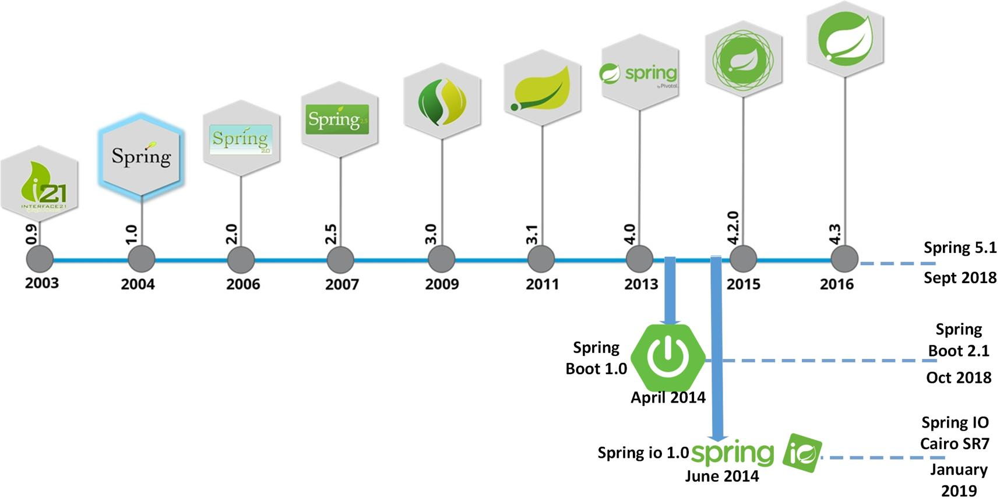
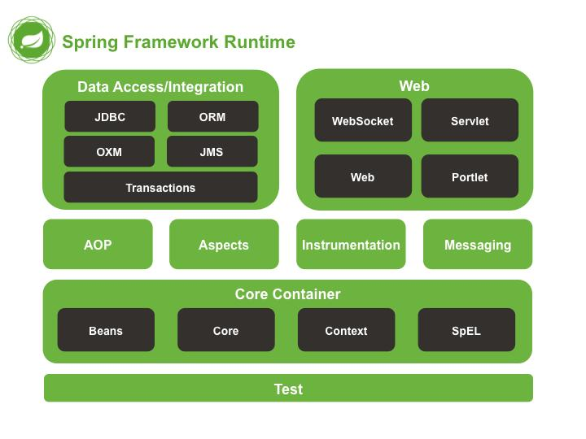

# Spring

Absolutely. A useful way to organize your notes is to think of **Spring as an ecosystem**, not as a single framework.

## 1. Brief history of Spring





### The problem Spring was created to solve

In the early 2000s, enterprise Java development was largely based on **J2EE**. Building enterprise applications often involved a lot of configuration, heavyweight application servers, and tightly coupled components.

**Spring began in 2003** as a response to this complexity. Its central idea was:

> **Keep application/business logic simple and let a framework handle the infrastructure.**

The original Spring Framework emphasized **Inversion of Control (IoC)** and **Dependency Injection (DI)**, allowing objects to receive their dependencies rather than constructing them themselves. ([Home](https://docs.spring.io/spring-framework/reference/6.2/overview.html))

### Simplified evolution

| Period        | Development                                      | Why it mattered                                                              |
| ------------- | ------------------------------------------------ | ---------------------------------------------------------------------------- |
| **2003**      | Spring Framework begins                          | Alternative programming model to heavyweight J2EE                            |
| **2004–2008** | Spring becomes widely adopted                    | DI, AOP, transactions, JDBC, MVC, testing                                    |
| **2009**      | SpringSource acquired by VMware                  | Spring gains significant commercial backing                                  |
| **2013**      | **Spring Boot** introduced                       | Dramatically simplifies Spring application setup                             |
| **2014+**     | Spring Cloud                                     | Spring becomes heavily used for microservices/cloud                          |
| **2010s**     | Spring Data, Security, Integration, Batch mature | Spring expands beyond web applications                                       |
| **2020**      | Spring Framework 5.3 / Boot 2.x era              | Mature cloud-native ecosystem                                                |
| **2022**      | Spring Framework 6 / Boot 3                      | Java 17 baseline, Jakarta EE transition                                      |
| **2024–2026** | Boot 3.x → 4.x, Framework 6.x → 7.x              | Continued modernization, AOT/native, observability, AI, modular architecture |

The important conceptual progression is:

**Spring Framework → Spring Boot → Spring ecosystem**

Spring itself describes its ecosystem as modular: you can use only the projects you need. ([Home](https://spring.io/projects/))

---

# 2. What exactly is "Spring"?

This causes a lot of confusion when learning Spring.

There are three meanings commonly referred to as "Spring":

### Spring Framework

The **core framework**.

It provides things such as:

* Dependency Injection / IoC
* Application Context
* AOP
* Transaction management
* Spring MVC
* Spring WebFlux
* JDBC support
* Validation
* Scheduling
* Caching
* Testing support

([Home](https://spring.io/projects/spring-framework/))

### Spring Boot

A layer built around Spring Framework that makes it much easier to **create and run applications**.

It provides:

* Auto-configuration
* Starter dependencies
* Embedded servers
* Externalized configuration
* Production features
* Actuator
* Easy executable JAR deployment
* Minimal configuration

For example, instead of manually configuring a web server and many Spring components, you can create a Boot application and run:

```bash
java -jar my-application.jar
```

Spring Boot's goal is explicitly to provide a fast, opinionated starting point while allowing you to override those defaults when necessary. ([Home](https://docs.spring.io/spring-boot/))

### Spring Ecosystem

Everything around the Framework and Boot:

```text
                    Spring Ecosystem
                           │
             ┌─────────────┴─────────────┐
             │                           │
     Spring Framework              Spring Boot
             │                           │
             └─────────────┬─────────────┘
                           │
       ┌──────────┬────────┼─────────┬──────────┐
       │          │        │         │          │
    Security    Data     Cloud    Integration  Batch
       │          │        │         │          │
    GraphQL     Kafka    Gateway    AMQP        AI
    Session     Mongo    Config     etc.
```

---

# 3. The major Spring projects

Here is the part I'd recommend putting directly into your notes.

## A. Spring Framework — the foundation

**Purpose:** Core programming model for Java applications.

**Main capabilities:**

* IoC / Dependency Injection
* Beans and ApplicationContext
* AOP
* Transaction management
* Spring MVC
* Spring WebFlux
* JDBC support
* Validation
* Scheduling
* Caching
* Testing
* WebSocket
* HTTP clients

Think:

> **"The foundation on which most Spring applications are built."**

([Home](https://spring.io/projects/spring-framework/))

---

# 4. Spring Boot — application development

**Purpose:** Make Spring applications easy to create, configure and deploy.

Important features:

### Auto-configuration

Spring Boot examines your dependencies and automatically configures appropriate components.

### Starters

Instead of individually finding many dependencies:

```xml
spring-web
spring-webmvc
jackson
validation
...
```

you can use a starter such as:

```xml
spring-boot-starter-web
```

### Embedded server

A web application can contain its server rather than requiring deployment to an external application server.

For example:

```text
Spring Boot Application
       │
       ├── Your code
       ├── Spring
       ├── Tomcat/Jetty/etc.
       └── Dependencies
```

### Actuator

Provides production-oriented capabilities such as:

* Health checks
* Metrics
* Application information
* Monitoring endpoints

### Externalized configuration

Configuration can come from:

```text
application.properties
application.yml
Environment variables
Command-line arguments
Configuration servers
```

Spring Boot is therefore the project you will encounter in **most modern Spring applications**. ([Home](https://docs.spring.io/spring-boot/))

---

# 5. Spring Data — database access

**Purpose:** Simplify access to databases and other data stores.

Spring Data provides a consistent programming model while still allowing each database technology to retain its specific capabilities. ([Home](https://spring.io/projects/spring-data/))

Major subprojects include:

* Spring Data JPA
* Spring Data JDBC
* Spring Data MongoDB
* Spring Data Redis
* Spring Data Cassandra
* Spring Data Elasticsearch
* Spring Data Neo4j
* Spring Data R2DBC
* Spring Data REST

For example:

```java
public interface UserRepository
        extends JpaRepository<User, Long> {
}
```

You can then perform operations such as:

```java
userRepository.findById(id);
userRepository.findAll();
userRepository.save(user);
userRepository.delete(user);
```

Spring Data can also derive queries from method names:

```java
List<User> findByLastName(String lastName);
```

So:

> **Spring Data = abstraction and convenience around data access.**

([Home](https://spring.io/projects/spring-data/))

---

# 6. Spring Security — application security

**Purpose:** Authentication and authorization.

It handles things such as:

* Login
* Authentication
* Authorization
* Password handling
* Roles and authorities
* Method-level security
* OAuth2
* OpenID Connect
* JWT/resource-server security
* CSRF protection
* Security filters

Conceptually:

```text
Request
   ↓
Spring Security
   ↓
Authenticated?
   ↓
Authorized?
   ↓
Controller
```

Example:

```java
@PreAuthorize("hasRole('ADMIN')")
public void deleteUser(Long id) {
    ...
}
```

Spring Security is the standard Spring project for securing applications. ([Home](https://docs.spring.io/spring-security/reference/spring-projects.html))

---

# 7. Spring Cloud — distributed systems / microservices

**Purpose:** Solve common problems when applications are distributed across multiple services.

For example:

```text
             API Gateway
                  │
        ┌─────────┼─────────┐
        ↓         ↓         ↓
    User       Order     Payment
   Service    Service     Service
        │         │         │
        └─────────┼─────────┘
                  ↓
             Config/Infra
```

Spring Cloud provides tools around patterns such as:

* Configuration management
* API Gateway
* Service-to-service communication
* Circuit breakers
* Service discovery
* Distributed messaging
* Cloud/platform integration
* Kubernetes integration
* Distributed application patterns

Important Spring Cloud projects include:

* Spring Cloud Config
* Spring Cloud Gateway
* Spring Cloud Circuit Breaker
* Spring Cloud OpenFeign
* Spring Cloud Kubernetes
* Spring Cloud Stream
* Spring Cloud Bus
* Spring Cloud Function

([Home](https://spring.io/projects/))

Think:

> **Spring Boot builds the service; Spring Cloud helps the services work together.**

---

# 8. Spring Integration — enterprise integration

**Purpose:** Connect different systems and applications.

Imagine:

```text
File
 ↓
Spring Integration
 ↓
Validate
 ↓
Transform
 ↓
Send to REST API
 ↓
Publish message
 ↓
Database
```

It implements well-known **Enterprise Integration Patterns** using messaging and adapters. ([Home](https://spring.io/projects/))

Useful when you need:

* Message routing
* Transformation
* Filtering
* Adapters
* Polling
* File integration
* HTTP integration
* Messaging workflows

---

# 9. Spring Batch — batch processing

**Purpose:** Process large volumes of data in jobs.

Example:

```text
10 million records
       ↓
     Reader
       ↓
    Processor
       ↓
     Writer
       ↓
   Database
```

Typical use cases:

* Importing CSV files
* Generating reports
* Processing millions of records
* ETL
* Data migration
* Scheduled jobs
* Financial processing

Spring Batch provides infrastructure for robust, restartable batch jobs. ([Home](https://docs.spring.io/spring-batch/reference/spring-projects.html))

---

# 10. Spring for Apache Kafka

**Purpose:** Integrate Spring applications with **Apache Kafka**.

Instead of working directly with low-level Kafka APIs, Spring provides familiar abstractions.

Typical architecture:

```text
Producer
   ↓
 Kafka Topic
   ↓
Spring Kafka Consumer
   ↓
Business Logic
```

Useful for:

* Event-driven architecture
* Asynchronous processing
* Streaming
* Microservice communication
* Event sourcing patterns

Spring's project catalog describes it as providing familiar Spring abstractions for Apache Kafka. ([Home](https://spring.io/projects/))

---

# 11. Spring AMQP

**Purpose:** Messaging through AMQP-compatible systems, especially RabbitMQ.

Example:

```text
Producer
   ↓
RabbitMQ
   ↓
Consumer
```

Spring AMQP provides Spring abstractions for AMQP-based messaging. ([Home](https://spring.io/projects/))

Think:

* **Spring Kafka → Kafka**
* **Spring AMQP → RabbitMQ / AMQP**

---

# 12. Spring GraphQL

**Purpose:** Build GraphQL APIs using Spring.

Instead of a REST API such as:

```text
GET /users/123
GET /users/123/orders
```

GraphQL allows clients to request the data they need through a GraphQL query.

Spring for GraphQL integrates Spring applications with GraphQL Java. ([Home](https://spring.io/projects/spring-graphql/))

---

# 13. Spring Session

**Purpose:** Manage HTTP sessions independently of the servlet container.

This becomes particularly useful in distributed applications:

```text
             Load Balancer
                  │
        ┌─────────┴─────────┐
        ↓                   ↓
   Server 1              Server 2
        │                   │
        └─────────┬─────────┘
                  ↓
             Redis/DB
           Session Store
```

This allows session information to be shared across multiple application instances.

Spring Session provides APIs and implementations for managing user session information. ([Home](https://docs.spring.io/spring-session/reference/spring-project.html))

---

# 14. Spring HATEOAS

**Purpose:** Build REST APIs following the **HATEOAS** principle.

Instead of returning only:

```json
{
  "id": 10,
  "name": "John"
}
```

the API can also provide links describing possible next actions.

```json
{
  "id": 10,
  "name": "John",
  "_links": {
    "self": {
      "href": "/users/10"
    },
    "orders": {
      "href": "/users/10/orders"
    }
  }
}
```

Spring HATEOAS provides support for creating REST representations following HATEOAS. ([Home](https://spring.io/projects/))

---

# 15. Spring Modulith

**Purpose:** Build **modular monoliths** using Spring Boot.

This is particularly interesting if you don't want to immediately split an application into microservices.

For example:

```text
E-Commerce Application
│
├── customer
├── order
├── payment
├── inventory
└── notification
```

All can remain in one deployable application while being organized into well-defined modules.

Spring Modulith helps verify module boundaries, test modules independently, observe module-level behavior, and generate documentation around the modular structure. ([Home](https://spring.io/projects/spring-modulith))

Think:

> **Spring Modulith = structure a monolith like a collection of well-defined modules.**

---

# 16. Spring AI

**Purpose:** Build AI-enabled applications using Spring.

It provides abstractions for integrating:

* AI models
* Enterprise data
* Vector databases
* Retrieval-Augmented Generation (RAG)
* AI tools/function calling
* Chat applications
* Embeddings

The Spring project catalog describes Spring AI as an application framework for AI engineering, particularly connecting enterprise data/APIs with AI models. ([Home](https://spring.io/projects/))

---

# 17. Other useful Spring projects

The Spring ecosystem is much larger than the projects above. The official catalog currently includes projects such as: ([Home](https://spring.io/projects/))

| Project                      | Main purpose                         |
| ---------------------------- | ------------------------------------ |
| **Spring Framework**         | Core Spring programming model        |
| **Spring Boot**              | Build/run Spring applications easily |
| **Spring Data**              | Database/data access                 |
| **Spring Security**          | Authentication & authorization       |
| **Spring Cloud**             | Distributed systems & microservices  |
| **Spring Integration**       | Enterprise integration/message flows |
| **Spring Batch**             | Large-scale batch processing         |
| **Spring Kafka**             | Kafka integration                    |
| **Spring AMQP**              | RabbitMQ/AMQP messaging              |
| **Spring GraphQL**           | GraphQL APIs                         |
| **Spring Session**           | Distributed/user session management  |
| **Spring HATEOAS**           | HATEOAS REST APIs                    |
| **Spring Modulith**          | Modular monolithic applications      |
| **Spring AI**                | AI/LLM application development       |
| **Spring for Apache Pulsar** | Apache Pulsar integration            |
| **Spring LDAP**              | LDAP integration                     |
| **Spring Shell**             | Command-line applications            |
| **Spring REST Docs**         | REST API documentation               |
| **Spring Web Services**      | SOAP web services                    |

The official project catalog is the best place to keep track of the current ecosystem because individual Spring projects have **independent release cycles and repositories**. ([Home](https://docs.spring.io/spring-framework/reference/6.2/overview.html))
